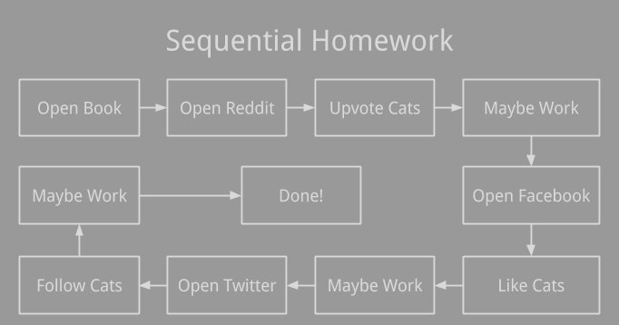
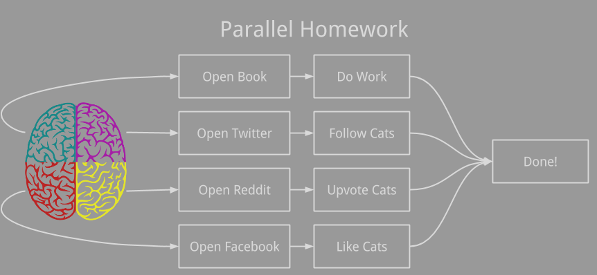

# Parallel computing

After your Stampede tour, you should know that a supercomputer is actually a collection of computers networked together. Besides solving many separate problems, complex problems can also be solved faster through parallel computation, the simultaneous use of multiple compute resources to solve a computational problem \[Barney\]. Your personal computers will use multiple cores to manipulate images and render the graphics in a video game. Scientists use thousands of cores on Stampede to predict the weather, simulate atoms, and analyze DNA.

To learn about Supercomputing today, you will

#### Objectives
1. Learn about sequential and parallel computation
2. Make simple graphics
3. Make distributed graphics
4. Create and benchmark a cluster

# Introduction

Software is typically written for sequential execution, where tasks are completed one-by-one and in order. If you're like me and can't multitask, your typical sequential homework workflow may look like this.

This is pretty inefficient and a homework deadline may interfere with your more important cat-liking.

To minimize internet-cat neglection, you can increase your cat-likes per minute (clpm) by completing each individual task faster. The only problem is that the speed of your brain, just like the clock rate of current silicon processors, can only go so fast. According to the Stanford CPU database \[Danowitz et al.\], processors haven't gotten faster since 2005.

No matter how much we've spent on the latest and greatest PC, sequential (single-core) programs won't be going any faster. You can see how 3D graphics have stagnated in the last 10 years with Animal Crossing in 2002 and Minecraft in 2011.

| Animal Crossing (2002) | Minecraft (2011) |
|---|---|
|| |

Haha, just kidding. Independent developers are brining back retro graphics, not hardware limitations. So what allows games like Skyrim and Forza have realistic graphics?

| Skyrim (2010) | Forza Horizon 2 (2014)|
|---|---|
|| |

Parallel computation!

You already know that the time it takes to do a single operation will never decrease, but we can perform multiple operations at once. All computers (and phones) today are usually dual-core or quad-core, allowing them to perform more tasks simultaneously. While clock-rates haven't changed since 2005, but as predicted by Moore's law

> The number of transistors incorporated in a chip will approximately double every 24 months.
> --Gordon Moore

leading to more complex instructions and more cores. Plotting the number of transistors for each CPU in the Stanford CPU DB \[Danowitz et al.\] on the logarithmic scale shows a linear trend (exponential), supporting Moore's Law.

You can even think about transisitors, or electronic switches, as the neurons in your brain. If you're exremely talented and work at TACC, so you have enough monitors, you can complete your homework workflow in parallel.

The idea of discrete portions of your brain independently completing certain tasks is essentially how a multi-core processor works. However our focus has limits, so we don't scale as well as the average computer.

## Supercomputers

Besides working on a lots of unrelated problems, supercomputers, like Stampede, can also cooperate to complete tasks faster. You can think of these problems like group projects, where each separte computer is a member of the group. To make sure everyone contributes, and the project gets done on time, you probably make each member responsible for certain tasks. This is the same for computers, where tasks are distributed across computers to efficiently share the load. Just like people, computers can also ask for help to solve a problem and share knowledge amongst eachother, but instead of talking they send messages over a network. 

 At TACC, we focus on low-latencey communication over [InfiniBand](https://en.wikipedia.org/wiki/InfiniBand), by Mellanox. This allows for thousands of computers to synchronize without waiting long periods just for a chance to speak. You won't be getting ultra-fast streaming from netflix or youtube on a protocol like this because it was designed for short distances, but Stampede will be able to predict [the next hurricane](http://earth.nullschool.net/)!    

# Next

Now that you have an idea of what parallel computation can be, lets learn about making graphics in the Processing programming language, so we can eventually make some parallel visualizations today.

#### Objectives

:white_check_mark: Learn about sequential and parallel computation  
:arrow_right: [Make simple graphics](02-simple-graphics.md)

# Citations

Data for CPU freqency and transisor figures came from Danowitz et al.

1. Barney, Blaise. "Introduction to parallel computing." Lawrence Livermore National Laboratory 6, no. 13 (2010): 10.
2. Danowitz, Andrew, Kyle Kelley, James Mao, John P. Stevenson, and Mark Horowitz. "CPU DB: recording microprocessor history." Communications of the ACM 55, no. 4 (2012): 55-63.
