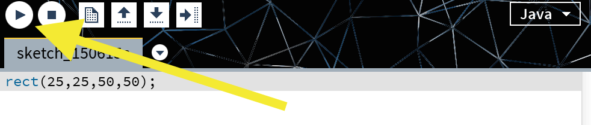

# Simple Graphics

[</br></br>rocessing](https://processing.org/) is the open source language developed over the Java programming language to aid teaching computer programming through visual interactions. In this section, we will be learning the basics of processing to aid us in understanding distributed computing.

#### Objectives

1. Install Processing
2. Make a simple sketch
3. Make an animation

# Installation

First, you need to install processing on your Raspberry Pi 2. There is no official ARM version of processing available, but luckily it runs in java, making it (mostly) platform independent. Install processing by first pulling the latest version of the summer-2015 git repository and then running `install_processing.sh`.

```shell
cd ~/summer-2015 # or where you checked out this reposoitory
git pull
cd parallel
sudo ./install_processing.sh
```

Launche the Processing IDE using the command

```shell
processing
```

### Manual installation

***Disregard if you did an automatic install***

You can also do a manual installation if you would like to learn how to install software without using apt-get. First, Processing 2.2.1 (stable) requires Oracle Java 7, so we'll need to download and install that from the Raspbian repositories.

```shell
sudo apt-get -y install oracle-java7-jdk
```
Now that we have java, we can download and un-tar processing.

```shell
wget http://download.processing.org/processing-2.2.1-linux32.tgz
tar -xzf processing-2.2.1-linux32.tgz
```

The -xzf parameters tell tar to e(x)tract and un(z)ip the (f)ile: processing-2.2.1-linux32.tgz. The gz in tgz denotes a gzipped tarball. Now, we just need to link in our new Java to make it functional.

```shell
cd processing-2.2.1
rm -rf java
ln -s /usr/lib/jvm/jdk-7-oracle-armhf java
```

The ln command makes a [symbolic link](http://en.wikipedia.org/wiki/Symbolic_link) to our Oracle Java 7 without having to move or copy the installation. We can now test to make sure everything worked by launching Processing.

```shell
./processing
```

## Processing IDE

After launching processing and some messages are printed to your console, the graphical IDE pictured below should appear.


IDE stands for *Integrated Development Environment* and usually allows code editing, building, and debugging all from inside the single program. All of our Processing development will be taking place inside of this IDE, so you won't be learning any new keyboard shortcuts! Even though IDE development is easier, knowing how to edit text inside a terminal is invaluable when working on remote systems like stampede. Up next, we'll be making our first program, or sketch.

# First Sketch

Lets make a really simple first sketch.

```processing
rect(25,25,50,50);
````

Now run the program by pressing play!



After waiting a few seconds, a window that looks like the image below should appear.


While a simple square on a window may not seem very impressive, take a look at your single line transformed into real Java code.

```java
import processing.core.*;
import processing.data.*;
import processing.event.*;
import processing.opengl.*;

import java.util.HashMap;
import java.util.ArrayList;
import java.io.File;
import java.io.BufferedReader;
import java.io.PrintWriter;
import java.io.InputStream;
import java.io.OutputStream;
import java.io.IOException;

public class first extends PApplet {
  public void setup() {
rect(25,25,50,50);
    noLoop();
  }

  static public void main(String[] passedArgs) {
    String[] appletArgs = new String[] { "first" };
    if (passedArgs != null) {
      PApplet.main(concat(appletArgs, passedArgs));
    } else {
      PApplet.main(appletArgs);
    }
  }
}
```

Scary.

This pile of Java is why Processing was developed. You don't start with the traditional "Hello World!"; you're starting with a graphic! From a single line, which the compiler turned into complicated Java code. Before we make a bigger and better program, lets learn a little about the window, or canvas, that all graphics are drawn to.

# The Processing Canvas

The processing canvas sits on a coordinate system. When the square was drawn to the canvas we drew it to point (25,25). If we were drawing the square on a calculator or a graph, (25,25) would be in the upper-right corner. However, (0,0) is the upper-left and (&infin;,&infin;) is the lower-right on a processing canvas.

| Graph | Processing |
|-------|------------|
||

Now that you how shapes are drawn on the canavs, we can experiment with the rect command. According to the [documentation](https://processing.org/reference/rect_.html), the parameters of `rect(x,y,w,h)` correspond to:

| Parameter | Description |
|---|:---|
| x | x-coordinate of the top-left corner |
| y | y-coordinate of the top-left corner |
| w | width of the rectangle |
| h | height of the rectangle |

## Activity

Take some time and try to replicate these examples from what we learned about the `rect()` command.

| Objective | Example |
|:--|---|
| Draw the square in the lower-left corner |  |
| Draw the square half off the screen |  |
| Draw a rectangle |  |
| Draw multiple rectangles |  |

After recreating all examples, take a look at the "2D Primitives" in the [Processing documentation](https://processing.org/reference/) and try making other shapes. A good start would be using `ellipse()` to make a circle.

## What you learned

1. You learned how to draw rectangles of different sizes all around your Processing canvas.
2. You learned how to read the documentation to draw different shapes we didn't cover in this lesson.

# Simple Animation

Now that you can make simple shapes and understand how to draw them to different parts of the canvas, you're ready to make your first animation. Fist, lets learn about two important sections in processing code: [setup](https://processing.org/reference/setup_.html) and [draw](https://processing.org/reference/draw_.html).

## [Setup](https://processing.org/reference/setup_.html)

Processing automatically looks for and calls the `setup()` function when a program starts. Your Processing sketch can have **only one `setup()` function.** It is used to define initial environment properties like:

#### Canvas size
The canvas size can be specified with the [`size()`](https://processing.org/reference/size_.html) command, which takes the two arguments: width and height. Processing defaults to a 100 by 100 pixel canvas. If we wanted to create a canvas that was 300 pixels wide and 200 pixels tall, we would define `setup()` like so:

```processing
void setup() {
  size(300,200);
}
```
#### Background color
You can set the background of your canvas to either a specific color or an image using the `background()` function in your `setup()` initialization. The default background is the light gray you saw behind your white shapes, but you can change that color 4 main ways:

* background(rgb)
* background(gray)
* background(v1, v2, v3)
* background(image)

| Parameter | Type | Description |
|:----:|:----:|:---|
| rgb | int | Any value of the color datatype or a hex code|
| gray | float | Specifies a value between white and black [0,255]|
| v1 | float | Red or hue value (depending on the current color mode)|
| v2 | float | Green or saturation value (depending on the current color mode)|
| v3 | float | Blue or brightness value (depending on the current color mode)|
| image | PImage | PImage to set as background (must be same size as the sketch window)|

Lets be extra interesting and make a light blue background.

```processing
void setup() {
  background(#99CCFF);
}
```

You can also pick a different color from http://www.w3schools.com/tags/ref_colorpicker.asp.
<!--
#### Execution rate

When we finally make our animation, we can specify the framerate to render the animation at with the `frameRate()` command. By default, Processing tries to render at 60 frames per second (fps), so lets change it to a sane 30 fps for the Pis with the code:

```processing
void setup() {
  frameRate(30);
}
```-->

Make sure that any commands are all in the same `setup()` function because there can only be one per program, and any extras won't be called. Otherwise, you will get "duplicate method setup()..." errors if you try to include more than one.

## [Draw](https://processing.org/reference/draw_.html)

The other main function besides `setup()` is `draw()`. It is called directly after `setup()` and continuously loops over the code inside it until the sketch is killed. Because `draw()` is called automatically, you never have to call it yourself. **Just like with `setup()`, there can only be a single `draw()` function per sketch.**

All the fun happens inside `draw()` and since it loops, we can update each of the objects that we're drawing. Lets give it a try with

```processing
void draw() {
  rect(25,25,50,50);
}
```

Nothing moved! *Hopefully this wasn't disappointing.*

You should see that while we are drawing the rectangle in a loop, we never update **where** it is drawn. We can fix this by using variables to specify where the rectangle is drawn. Let's use `xPos` for the x-position and `yPos` for the y-position, and make them a floating point number (float), otherwise known as a decimal.

```processing
float xPos = 0.0;
float yPos = 0.0;

void draw() {
  rect(xPos, yPos, 50, 50);
}
```

The square now starts in the top-left corner of the canvas, but it still doesn't move. We just need to use some physics and give it a velocity, or a rate the position changes at. In this case, lets change both the x and y positions at 0.5 pixels per frame, making the rectangle move towards the lower-right corner.

```processing
float xPos = 0.0;
float yPos = 0.0;

void draw() {
  rect(xPos,yPos,50,50);
  xPos+=0.5;
  yPos+=0.5;
}
```

It moves!

Lets finish up this example by cleaning up the path of old rectangles by redrawing the background (grayscale 204) before drawing a new rectangle.

```processing
float xPos = 0.0;
float yPos = 0.0;

void draw() {
  background(#99CCFF);
  rect(xPos,yPos,50,50);
  xPos+=0.5;
  yPos+=0.5;
}
```

Watch out Pixar, CODE@TACC is moving boxes!

## Activity

Now that you can make a shape move across your Processing canvas, try to do the following exercises.

1. Make a square move from the top-left to the top-right.
2. Make a circle move from the bottom-right to the top-right.

## What you learned

1. You learned to move a square along the x-axis.
2. You learned to first reposition a circle since it is drawn from the center and then move it along the y-axis.

# Reactive Animation

To put the finishing touches on the animation we made, we're going to use conditional (if) statements to make changes to our animation to make our rectangle bounce when it hits the edge of our canvas. To do so, we first need to introduce a velocity variable.
```processing
float xPos = 0.0;
float yPos = 0.0;
float xVel = 1.0; //x-velocity
```
This allows to to change it from positive (moving left to right) to negative (right to left) when our program runs. Now, lets incorporate xVel into our draw update.
```processing
void draw() {
  background(#99CCFF);
  rect(xPos,yPos,50,50);
  xPos += xVel;
  yPos += 0.5;
}
```

If you run the program, your shape should run off the right of your screen twice as fast as it usually did, so we just need it to change directions when it reaches the right wall of your canvas.

```processing
void draw() {
  background(#99CCFF);
  rect(xPos,yPos,50,50);
  if(xPos > width) { // width equals the width of your canvas
    xVel *= -1;
  }
  xPos += xVel;
  yPos += 0.5;
}
```

While the code above makes the rectangle bounce back from the right side, it does so *after* moving past the edge. We can fix this by changing the bound to the canvas width minus the width of the rectangle (50).

```processing
void draw() {
  background(#99CCFF);
  rect(xPos,yPos,50,50);
  if(xPos > width-50) {
    xVel *= -1.0;
  }
  xPos += xVel;
  yPos += 0.5;
}
```

Now we just need to make the rectangle bounce off the left side as well.

```processing
void draw() {
  background(#99CCFF);
  rect(xPos,yPos,50,50);
  if(xPos > width-50) {
    xVel *= -1.0;
  }
  if(xPos < 0) {
    xVel *= -1.0;
  }
  xPos += xVel;
  yPos += 0.5;
}
```

If you remove the yPos update, you rectangle will bounce between the two walls forever!

## Activity

1. Have a circle bounce back and forth without going past the edge.
2. Add a y-velocity (yVel) and make the rectangle bounce back from the edges of the y-axis.

## What you learned

1. You calculated the radius of your cicle and changed the bound of your bounce to make sure it happend at the edge of the circle.
2. You added a y-velocity to the rectangle example and made it bounce back from the y-axis bounds.

# Next

You're officially off to a good start with animations in processing. If you want to learn more and have time, take a look at

* [Processing reference](https://processing.org/reference/)
* [Processing examples](https://processing.org/examples/)

to learn how to do more things like color and input. We however will be moving on to making animations distributed across multiple Raspberry Pis.

:white_check_mark: [Learn about sequential and parallel computation](01-introduction.md)  
:white_check_mark: [Make simple graphics](02-simple-graphics.md)  
[:arrow_right: Make distributed graphics](03-distributed-graphics.md)
