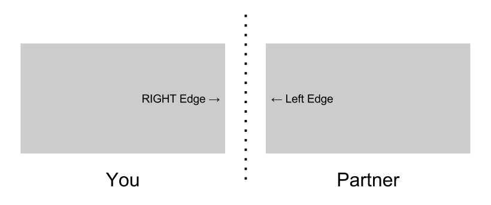
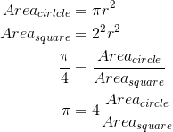

# Distributed Graphics

As everyone at TACC already knows, the world depends on parallel code to drive technological advancement because physicists won't be making silicon processors any faster. Luckily, we'll be writing distributed parallel code in this section using the Processing [Network library](https://processing.org/reference/libraries/net/). We will start by using Processing to visualize our distributed operations and then combine all our Raspberry Pis and construct a super computer at the end of the day and run a real benchmark.

#### Objectives

1. Send a message between computers
2. Send a ball between computers
4. Construct cluster for Graph500

# Send a message

In processing, open the sketch

`~/summer-2015/parallel/send_message/send_message.pde`

You'll see that you need your partner's IP address, so your program knows *where* to send the message and if your partner's computer is even listening for one. First, get your IP address and write it down on a post-it note because we'll be using it later.

```shell
$ hostname -I
```

Exchange ip addresses with your neighbor to fill in the `partnerIP` variable in the `send_mesage` sketch. 

```processing
String partnerIP = "N.N.N.N"; //write your partner's ip here
```

becomes

```processing
String partnerIP = "192.168.1.4"; //write your partner's ip here
```

Now, you just need to make in a message to send to your partner by modifying `myMessage` to something fun.

```processing
String myMessage = "";
```

to

```processing
String myMessage = "cats";
```

After you've both modified these variables, run both of your sketch and you Pis connect to eachother you should see the following output:

```
My server is running on port 5204
Connecting to partner at 192.168.1.4:5204
Connected!
```

If you don't see the "Connected!" message, make sure your partner launched their program and then verify that partnerIP does match your partner's IP address and both of your port variables are set to 5204. The setup portion of the code is somewhat complicated but necessary because processing doesn't like to automatically establish a connection when there wasn't one.

```processing
void setup() {
  // Start up your server
  me = new Server(this, port);
  println("My server is running on port",port);
  println("Connecting to partner at",partnerIP+':'+port);
  while( !pingable(partnerIP, port) ){
    // Wait until partner's server is running.
    delay(500);
  }
  // Connect to partners server
  partner = new Client(this, partnerIP, port);
  if(!partner.active()){
    // Check to see if connection worked
    println("Something went wrong with the connection");
    println("Please restart this program");
  }
  println("Connected!"); // Wooo
}
```

This forces your program to wait until your partner's server is [pingable](send_message/send_message.pde#L49-61) and your connection to them is active. After you get the "Connected!" status message, **switch to the canvas window and hit any key** to *send* your message, which triggers the `keyPressed()`.

```processing
void keyPressed() {
  // Sends your message when you press any key
  println("Sending: "+myMessage);
  partner.write(myMessage);
}
```

Your partner should get your message and you should get theirs. You can even modify this code to send a letter at a time, so you can send any message.

### Welcome to the world of Distributed Computing!

This first step was only slightly exciting, but it will also be the first test after we assemble our cluster. This ensures that each computer is able to talk to the other. All types of networked communication works though client/server interactions of this manner. Internet browsers are clients asking servers for files residing in a specific location at an internet addresss. On supercomputers, we use [Open MPI](https://en.wikipedia.org/wiki/Open_MPI) to coordinate work over a network because a program can't span two computers.

Now that sent your first message over the network, lets work on shoving a ball through our wireless tube.


# Send a ball

Take a look at the base example [`bouncing_network/bouncing_network.pde`](bouncing_network/bouncing_network.pde). Just like the send message program, you first need to fill in your partner's IP address.
```processing
void setup() { // sets up server
  size(500, 500);
  fill(0);
  server = new Server(this, 2342);
  left = new Computer(this, "N.N.N.N", 2342); // left computer's IP
  right = new Computer(this, "N.N.N.N", 2342); // right computer's IP

  background(255);
  bag.add(50, 50, 1, 2, 25);
}
```


If you're seated on the left, put your partner's IP address in the `right` variable; otherwise the `left`. Lets say I'm on the left and my partner's IP is 1.2.3.4. I should then alter my code to look like

```processing
left = new Computer(this, "N.N.N.N", 2342); // left computer's IP
right = new Computer(this, "1.2.3.4", 2342); // right computer's IP
```

If you start the program now, the barrier between your two windows will be soft, and the ball won't bounce. You computer will send the coordinates, and parameters of our ball (not a graphic or image) as a string to your partner's computer.

#### Message
`x-position, y-position, x-velocity, y-velocity, radius`

This works because each computer knows how to interpret this message when it shows up. If it ever got a different message, the program would break because it wouldn't be expected. You would have to update the program on all computers. That being said, you can do whatever you want to the ball on your computer. Some things you can change are:

- Size
- Velocity

You can also create different obstacles for your ball to encounter. This is because each computer is running a separate simulation. If you happen to have 100 balls on your screen, your program will probably crawl along while other computers are still speedy.

After you and your partner have the basics down, try completing some of the challenges with your whole table.

# Challenges

#### 1. Click to add
Add a new ball wherever you click on the canvas by modifying the `mouseClicked()` section.
```processing
void mouseClicked() {
  // mouseX and mouseY are handy
  // random(lower, upper) is cool too
}
```
You can add new balls to your screen with the command
```
bag.add(x-pos, y-pos, x-vel, y-vel, radius);
```
and filling in the appropriate values. You can even have those values correspond to your mouse with `mouseX` and `mouseY`. Lastly, make the ball have varying velocities and radii with the `random(min, max)` command. Just make sure you don't pass invalid values.

- Radius must be > 1 (so its larger than a single pixel)
- x-velocity should be somewhere between -10 and 10
- y-velocity should be somewhere between -10 and 10 (so you can see it)

I'll let you figure out the rest.
#### 2. Create obstacles
Add a new object to the screen that the balls either bounce off of or speed up over. First, create some area on your canvas and make it a different color with the `fill()` command.
```
void draw() {
  background(255);
  
  // New object
  fill(150);
  rect(200,200,100,100);
  // End of new object
  
  fill(0);
  bag.update();
  bag.draw();
  .
  .
  .
}
```

Then, alter the ball's `update()` method to react when encountering this object.

```processing
class Ball {
.
.
.
  boolean update() {
    this.x += this.xv;
    this.y += this.yv;

    if (this.x < this.radius) {
      return goTo(left);
    } else if (this.x > width - this.radius) {
      return goTo(right);
    } else if (this.y > height - this.radius || this.y < this.radius) {
      flipY();
    }

    // check to see if over new object
    if( this.x >= 200 && this.x <= 300 && this.y >= 200 && this.y <= 300 ) {
      //speed up
      //this.xv += 0.1;
      //this.yv += 0.1;
      //slow down
      //this.xv -= 0.1;
      //this.yv -= 0.1;
    }
    
    return false;
  }
```
You can also have it bounce back like from a wall!

If you have more time, see if you can use the keyboard to move the object like a pong paddle.

#### 3. Add more monitors
You have a left and a right, so try to make a ring around your table and see how crazy it gets.
#### 4. Add color
Assign a random color to each of your balls and render them that way on your screen. This would be achieved in the inital `ball()` constructor and with the `fill()` command in `ball.draw()`.
#### 5. Make the balls ricochet
This would be achieved inside the `bag.update()` function, and you'll need to add another for loop to make a pairwise comparison between all balls.

You and your partner don't even need to complete the same goals and have the same code, as long as your changes don't affect the structure of the ball.

As long as you're not changing the structure of the ball, you can do whatever you want on your end.

# Other Methods

What you just made was a distributed visualization. This means that each computer was responsible for rendering a certain portion of a visualization and just needed to communicate changes to its neighbors. A processing library called [Most Pixels Ever](https://github.com/shiffman/Most-Pixels-Ever-Processing) exists, which seems similar, but only the view of the visualization is distributed. Each computer MUST render EVERYTHING, so it doesn't make the computation any easier, it just means you can spread it across more monitors.

# Your First Computation

Open up the `pi/pi.pde` processing sketch and run it. This program incrementally [approximates the value of pi through monte carlo integration.](http://polymer.bu.edu/java/java/montepi/MontePi.html)



Now, try uncommenting

```processing
/* remove this line to uncomment
me = new Server(this, port);
connectToPartner(this);
*/
```

by removing both /* and */ fences to run the computation with your partner. This gives you twice as many points per second, making your computation twice as effective.

# Next

:white_check_mark: [Learn about sequential and parallel computation](01-introduction.md)  
:white_check_mark: [Make simple graphics](02-simple-graphics.md)  
:white_check_mark: [Make distributed graphics](03-distributed-graphics.md)  
[:arrow_right: Green Graph500](greengraph500/01-greengraph500.md)
