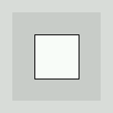

# First Sketch

```processing
rectangle(25,25,50,50);
````

Press play!



While a simple square on a window may not seem very impressive, take a look at your single line transformed into real Java code.

```java
import processing.core.*; 
import processing.data.*; 
import processing.event.*; 
import processing.opengl.*; 

import java.util.HashMap; 
import java.util.ArrayList; 
import java.io.File; 
import java.io.BufferedReader; 
import java.io.PrintWriter; 
import java.io.InputStream; 
import java.io.OutputStream; 
import java.io.IOException; 

public class first extends PApplet {
  public void setup() {
rect(25,25,50,50);
    noLoop();
  }

  static public void main(String[] passedArgs) {
    String[] appletArgs = new String[] { "first" };
    if (passedArgs != null) {
      PApplet.main(concat(appletArgs, passedArgs));
    } else {
      PApplet.main(appletArgs);
    }
  }
}
```

Scary.

This pile of Java is why Processing was developed. You don't start with the traditional "Hello World!"; you're starting with a graphic! From a single line, which the compiler turned into complicated Java code. Before we make a bigger and better program, lets learn a little about the window, or canvas, that all graphics are drawn to.

# The Processing Canvas


