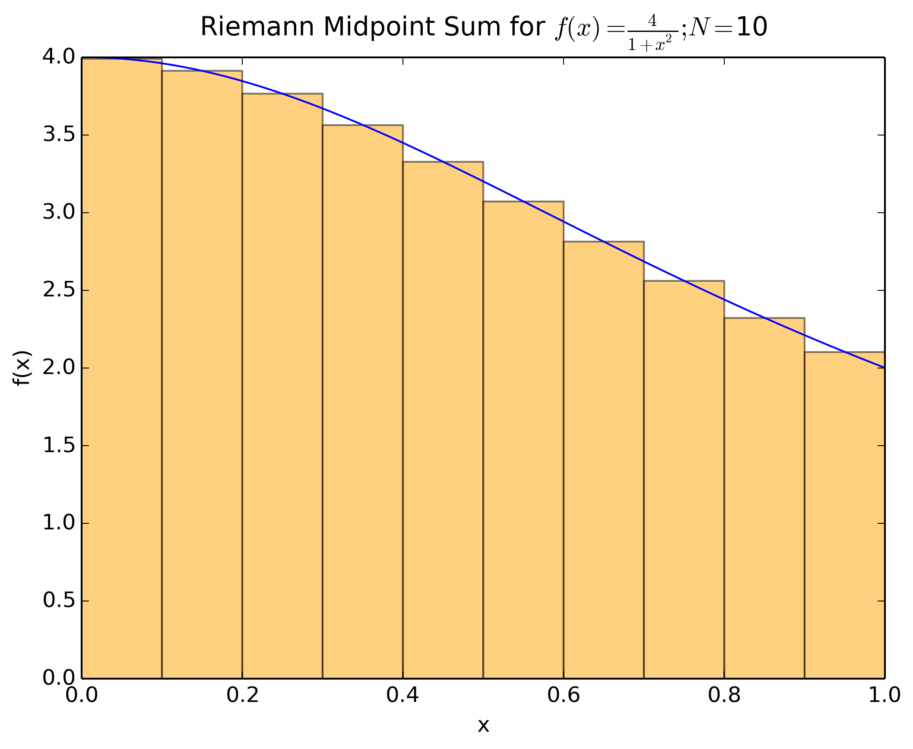

# Building a Raspberry Pi Cluster

#### Hardware

There are quite a few tutorials out there on how to set up a distributed cluster of sorts. When first getting started, it can be confusing to know which one to pick, what to actually do (or not do), and how to do it. The biggest challenge is actually bookkeeping. At the absolute minimum, you will need:

1. At least two computers, they can be almost any make but it is easiest to have two of the same (Raspberry Pis)
2. One router
3. One switch
4. Enough Ethernet cables to connect the computers to the switch, the switch to the router, and probably the router to the internet

The setup would look something like


That is all the hardware you need to get a cluster up and running!

#### Software

We are currently using a Linux distribution called [Raspbian](https://www.raspbian.org) which is a derivative of the Debian Linux distribution:


Some other popular distributions include Ubuntu, CentOS, Mint, and SUSE. Slackware was my first love.

On our Debian-based systems, we have been using apt-get to grab pre-compiled software packages from the "cloud" -- for free I might add. For us to run Graph 500 across our of our pis, we will be using a library called MPI (Message Passing Interface). MPI has become the defacto standard in high performance computing for distributed memory clusters. One implementation that we can get from apt-get is called [Open MPI](https://www.open-mpi.org). MPI has rules for the C and Fortran languages.

To install the software we need to make our Pi cluster, run the mpi_install script in parallel/greengraph500/setup/mpi_install. The first time, while you are still at your stations you will verify that your repository is located in your home directory. 

```
ls ~/summer-2015
```

If you get a message

```
ls: cannot access /home/pi/summer-2015: No such file or directory
```

we will need to move your repository first!

Once every has their repos located at ~/summer-2015, go ahead and navigate to the setup directory and run the mpi_install script like

```
cd ~/summer-2015/parallel/greengraph500/setup
install=true ./mpi_install
```

The install will take 5 to 10 minutes. Some of the software you all have already installed but this is everything that is needed

```
sudo apt-get update -y
sudo apt-get upgrade -y
sudo apt-get install build-essential -y
sudo apt-get install gfortran -y
sudo apt-get install openmpi-dev -y
sudo apt-get install openmpi-bin -y
```
There are a few other cool tools installed too

```
sudo apt-get install vim -y
sudo apt-get install nmon -y
sudo apt-get install apt-transport-https ca-certificates -y
sudo wget http://goo.gl/rsel0F -O /etc/apt/sources.list.d/rpimonitor.list
sudo apt-key adv --recv-keys --keyserver keyserver.ubuntu.com 2C0D3C0F 
sudo apt-get update -y
sudo apt-get install rpimonitor -y
sudo apt-get update -y
sudo apt-get upgrade -y
sudo /usr/share/rpimonitor/scripts/updatePackagesStatus.pl
```

Namely nmon and rpimonitor (oh and vim -- which is way better than emacs).

#### nmon

nmon is a fun little tool that is a real time terminal-based resource monitor. You can open up a terminal window, type "nmon" and it will come up asking what you wish to display. Typically, a choice of "c" for CPU load is what we are curious about.


#### RPi Monitor

RPi Monitor is a cool suite of tools to help asses the health and status of your raspberry pi. Once installed, you should be able to navigate to "localhost:8888" in your browser to start the monitor and to see what is going on.

#### MPI Hello World

Once our installation has completed, we are going to test out our MPI installation and make sure everything is happy and running. Try

```
cd ~/summer-2015/parallel/greengraph500/hello
./run 4
```

First, we are compiling the Fortran code mpi_hello.F90 using the MPI gfortran wrapper mpif90 and producing the executable called "hello".

Next, once we have successfully compiled our hello executable, we are using the mpirun process launcher to spawn 4 mpi processes all on your local machine to run the hello executable at the same time. We are providing a hostfile for mpirun to know where to run the mpi processes.

Our output will look like (with your hostname instead of cypy):

```
==============================================
Hello from MPI Task:   0 on host: cypy      ||
Hello from MPI Task:   1 on host: cypy      ||
Hello from MPI Task:   2 on host: cypy      ||
Hello from MPI Task:   3 on host: cypy      ||
==============================================
```

#### MPI Hello World with a Friend

NOTE: You must first have successfully run MPI Hello World above.

First, figure out what your local IP address is:

```
hostname -I
```

and you will likely see something like

```
10.123.4.56
```

Exchange your IP address with your neighbor and place the IP address of your neighbor in myhostfile. myhostfile will now have your hostname and your neighbor`s IP address. For instance:

```
cypy
10.123.4.56
```

Now, rerun hello world:

```
./run 4
```

If successful, you should see output similar to:

```
==============================================
Hello from MPI Task:   0 on host: cypy      ||
Hello from MPI Task:   1 on host: ras1      ||
Hello from MPI Task:   2 on host: cypy      ||
Hello from MPI Task:   3 on host: ras1      ||
==============================================
```

Where both you and your neighbor`s hostnames should be displayed.

What happens when you try 

```
./run 8
```

#### Pi on Your Pis

There is no better way to utilize your pi`s power other than computing the value of Pi! In this case, we can calculate the integral of a function f(x): 


over the interval between 0 and 1:


to find that the answer is, in fact, Pi.

Computers generally cannot play with numbers in infinite precision like we can with pencil and paper. Instead, they can try really hard to *approximate* the answer to this integral. One way to tell the raspberry pi to approximate the answer is with:


where


and N is the number of subintervals used. We are, in essence, using rectangles to approximate the area under our function f(x). 


The more subintervals (N) used



the closer the computer gets to the actual answer


and the harder the computer has to work to get that answer.

We can use this approximation in parallel via MPI and working with our neighbor`s raspberry pis to help out. To do this:

```
cd ~/summer-2015/parallel/greengraph500/pi
./run 1 3
```

where the first number (1 in this case), is the number of MPI processes to use in the pi calculation and the second number (3 in this case) is the number of subintervals, N, to use for the approximation.

You will get output similar to:

```
pi@cypy:pi>./run 1 3

==========================================
Hello from MPI Task:   0 on host: cypy  ||
==========================================

=================================================================
MPI Task:   0 num_subintervals Value:                       3  ||
=================================================================

==================================================================
MPI Task:   0 offload_threshold Value:                       1  ||
==================================================================

====================================================================
MPI Task:   0 my_num_subintervals Value:                       3  ||
====================================================================

=======================================================================
Hello from MPI Task:  0 OMP Thread:  0 MPI Total:  1 OMP Total:  1   ||
=======================================================================

=========================
OpenMP is NOT enabled  ||
=========================

====================================================================
MPI Task:   0 num_offload_devices Value:                       0  ||
====================================================================

===============================================================
MPI Task:   0 my_start_index Value:                       1  ||
===============================================================

===============================================================
MPI Task:   0   my_end_index Value:                       3  ||
===============================================================

===================================
MPI Task:   0 Running on a HOST  ||
===================================

==============================================================
MPI Task:   0 omp_get_wtime Value:  -0.100000000000000E+01  ||
==============================================================

==============================================================
MPI Task:   0     mpi_wtime Value:   0.166392326354980E-02  ||
==============================================================

==============================================================
MPI Task:   0  system_clock Value:   0.165000000000000E-02  ||
==============================================================

==============================================================
MPI Task:   0      cpu_time Value:   0.000000000000000E+00  ||
==============================================================

===============================================================
MPI Task:   0 my_subintegral Value:   0.315084920986560E+01  ||
===============================================================

===============================================================
MPI Task:   0       local_pi Value:   0.315084920986560E+01  ||
===============================================================

===============================================================
MPI Task:   0      global_pi Value:   0.315084920986560E+01  ||
===============================================================

=================================================================
                       exact_answer:    0.314159265358979E+01  ||
                 approximate_answer:    0.315084920986560E+01  ||
                absolute_difference:    0.925655627581046E-02  ||
                 percent_difference:    0.294645337460708 %    ||
=================================================================
                 omp_wtime_total(s):   -0.100000000000000E+01  ||
                 mpi_wtime_total(s):    0.166392326354980E-02  ||
              system_clock_total(s):    0.165000000000000E-02  ||
                  cpu_time_total(s):    0.000000000000000E+00  ||
=================================================================
      omp_wtime_avg_per_mpi_task(s):   -0.100000000000000E+01  ||
      mpi_wtime_avg_per_mpi_task(s):    0.166392326354980E-02  ||
   system_clock_avg_per_mpi_task(s):    0.165000000000000E-02  ||
       cpu_time_avg_per_mpi_task(s):    0.000000000000000E+00  ||
=================================================================
      omp_wtime_avg_per_omp_task(s):   -0.100000000000000E+01  ||
      mpi_wtime_avg_per_omp_task(s):    0.166392326354980E-02  ||
   system_clock_avg_per_omp_task(s):    0.165000000000000E-02  ||
       cpu_time_avg_per_omp_task(s):    0.000000000000000E+00  ||
=================================================================

```

Try out several values of N starting with 1 and going up to something crazy big, like 1 billion! See how long the pi takes to run and watch how close the pi can get to the right answer with the absolute and percent difference reported. Try with your neighbor and see if you can do the same size problem faster than you did alone.

Try opening and second terminal and starting nmon with

```
nmon
```

Then press *c* and *m* to see the compute power and memory used while running with some big numbers.


## Network Logistics

At this point, we have the right software installed and we have tested that it is working as expected. The next step is for us to hook up all 32 pis to our 48 port switch, acquire an IP address and have our "reference" pi pick up this information.

When we are ready, everyone will shutdown their pi (save any of your work first!) from the command line with

```
sudo shutdown -h now
```

Wait until the green light stops flashing and only the red light remains. 

***Take out your USB wifi adapter*** and put it in your ziplock bag for safe keeping!

Disconnect your keyboard, mouse and monitor. We will need to rearrange the room so that we can have all the pis together in front of the switch. Bring your power cord, find an Ethernet cable to attach from your pi to the switch and then plug in and power up your pi.

Once everyone has hooked up their pis, I will be running a few scripts to set up files that include

1. creating a master /etc/hosts file
2. creating hostfile for mpirun
3. distributing the authorized keys for ssh to allow for passwordless access
4. distributing the /etc/hosts file

From there, we will try to run the MPI hello executable across all the pis at the same time! If that works, we are all set to run the green graph 500 benchmark!


# Running the Green Graph 500 Benchmark


#### What is the Green Graph 500?


[Graph 500](http://green.graph500.org/) is a relatively new benchmark meant to represent data intensive workloads in the fields of Cybersecurity, Medical Informatics, Data Enrichment, Social Networks, and Symbolic Networks. 


Graph algorithms are a core part of many analytics workloads. The argument by over 50 international HPC experts is that a new set of benchmarks is needed in order to guide the design of hardware architectures and software systems intended to support such applications and to help procurements. The hope is that Graph 500 can rise to that challenge and become a compliment to the well known [Top 500 List](http://www.top500.org) which runs a benchmark called HPL (High Performance LINPACK).

On the Graph 500 website, a benchmark specification is provided. Problem classes ranging from toy (level 10) on up to huge (level 15) are outlined. We are hoping that when all 28 of the Raspberry Pis (along with a few extra) are connected together, we ***might*** be able to run the toy class of the problem.

The benchmark is measured in MTEPS / Watt (Mega (Million) - Transversed Edges Per Second) and by the number of vertices (given by 2^(SCALE)).

With a total of 32 Pis with 4 cores each, we can run efficiently up to a total of 128 MPI processes. The benchmark will be started towards the end of the day and it will be run on increasing problem scales until we either run out of time or we run out of memory!

We will be using Kill A Watt EZ power monitors to figure out how much electricity we use for our raspberry cluster.


## Challenge

1. Try for a spot on the November 2015 list -- and, if we are lucky, above at least one other entry!
2. Over the next six days, work up to the toy class which consists of 67,108,864 vertices taking up over 17 GB RAM across all 32 Raspberry Pis.


# Overall Results

We were able to run all 32 pis together at a scale of 26 for a final score of 35.8254 GTEPS (Giga - Traversed Edges Per Second)! Power was measured for a 16 minute interval taking instaneous measurements every 2 minutes. The router, switch and raspberry pis averaged in 147.18 +/- 0.60 watts during the measurement period. The final Green Graph 500 score was 243.42 MTEPS/Watt. Unofficially, this is good enough for second place in the "Small Data" category!


# MPI Thought Experiments While You Wait

You all will be broken into teams of 8. Your job is to come up with solutions to the following two thought experiments. These represent some important and fundamental concepts in distributed parallel computing which are leveraged heavily in MPI libraries.

### Distributed Math Operations

1. Your team is given a zip lock bag of 80 numbers. 
2. Each team member can be thought of as an MPI process. 
3. Distribute 10 numbers to each team member. 
4. Your goal is to somehow sum all 80 numbers such that one team member has the final result.
5. Each team member, may (or may not), participate in the actual summation.
5. Design at least two different algorithms to come up with the sum of all 80 numbers. 
6. Note that communication of any numbers from one team member to another must be taken into account.
7. Design your algorithms such that they are more efficient than what the other teams come up with.
8. Can you come up with a third algorithm that is the least efficient?

### The Spaghetti Philosophers


Five silent philosophers sit at a round table with bowls of spaghetti. Forks are placed between each pair of adjacent philosophers.

Each philosopher must alternately think and eat. However, a philosopher can only eat spaghetti when they have both left and right forks. Each fork can be held by only one philosopher and so a philosopher can use the fork only if it is not being used by another philosopher. After a philosopher finishes eating, they need to put down both forks so the forks become available to others. A philosopher can take the fork on their right or the one on their left as they become available, but cannot start eating before getting both of them.

Eating is not limited by the remaining amounts of spaghetti or stomach space; an infinite supply is assumed.

The problem is how to design a discipline of behavior (a concurrent algorithm) such that each philosopher will not starve; i.e., can forever continue to alternate between eating and thinking, assuming that any philosopher cannot know when others may want to eat or think.

1. Can you come up with an algorithm that will continue forever if the philosophers do not communicate to each other?
2. Can you come up with an algorithm that will continue forever if the philosophers can communicate to each other?

You may want to assign numbers to the philosophers and to the forks as well for easier reference.

<!---
# Overall Results


We were able to run all 32 pis together at a scale of 26 for a final score of 35.5917 GTEPS (Giga - Traversed Edges Per Second)! If officially accepted, this could place us at position 62 on the Graph 500 Benchmark.
-->
