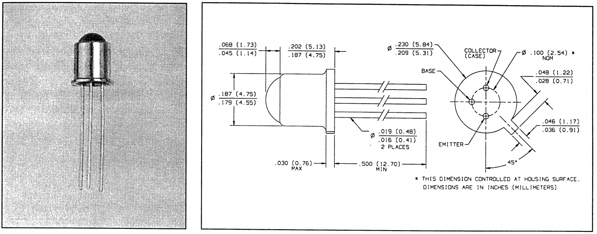
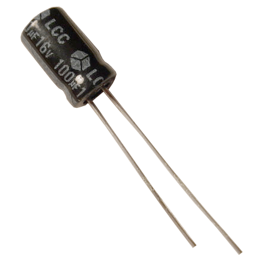
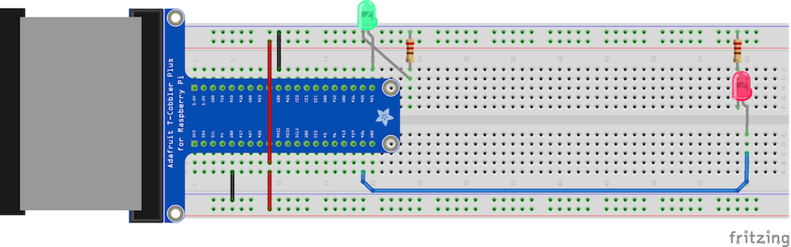

Raspberry Pi Pulsemeter
=======================

## Objectives
1. [How can our finger tell us our pulse?](../intro/index.md)
2. **[Starting with blinky lights... and testing](01_LEDs.md)**
3. [The analog-to-digital (A/D) converter](02_A2D_converter.md)
4. [Signal amplification](03_OpAmps.md)
6. [Maker Success!](04_Data.md)

## Housekeeping
Before we get too far, we should install the Python NumPy and Matplotlib packages.  We'll need them later.

```
sudo apt-get install python-numpy -y
sudo apt-get install python-dev -y
sudo apt-get install python-setuptools -y
sudo easy_install spidev
sudo apt-get install python-matplotlib -y
```
You can type these in individually or you can run the matplotlib_install Bash script. Either way, this process will take a few minutes to complete. To verify that everything has installed properly, try running:
```
python demo.py
```
and you should see a colorful scatter plot window appear after a few seconds.

## Tools of the trade
Before we start plugging things in, let's looks at the new stuff we have to play with today:

**1. Phototransistor** - when this component detects light, it tries to output current.  It looks a lot like a LED, but it follows different rules.  Transistors have 3 wires coming off of them - a "collector", an "emitter", and a "base".  The collector is generally attached to some current source, the base acts kind of like a gatekeeper, and the emitter is the output.  For our phototransistor, the emitter is the pin next to the little tab, the base is the pin in the middle, making the collector the pin on top.  For a phototransistor specifically, the light coming in acts as the "gatekeeper" to trigger the base, so we won't attach the middle pin of the phototransistor to anything.  The pin is there because it can be used to scale down the response, and we don't want to use that feature.


**2. Capacitors** - we will use 3 capacitors in the project.  Capacitors have a frequency dependent behavior.  They let higher frequencies through, but they "charge up" for low frequencies and DC current.  We will use them to control what frequencies of signal get through to the Raspberry Pi.  



Just like LEDs, electrolytic capacitors have a "polarity", which means they have to go in the correct direction.  The long pin (away from the white stripe) should go toward the higher DC voltage.  If you reverse the voltage on a capacitor enough, it will pop (please don't try it until after class)!


Capacitors are meastured in a unit called Farads, but 1 Farad is actually a LOT! We are using capacitor values in the micro-Farad range.  One capacitor is different from the other two.  Can you tell which one?

**3. Analog to Digital Converter** - Essentially the ears of the system.  An A/D converter can take a real-world signal as input, sample it quickly, and then output a digital representation of the amplitude of that signal. We have a 10-bit converter, which means that we give it a voltage range (3.3V in our case), and it will divide that into 2^10 pieces (which is 1024) and give us the closest value.  At 3.3V, it can resolve a real-world signal to around 3 millivolts.  The way it communicates back to the raspberry pi is using a convention called SPI.


**4. Quad Op-Amp** - An Op-Amp takes two inputs and has one output. The rules of how it works are interesting, and even more involved is the strange ways it can be wired to do what you want.  The purpose of the circuit is to amplify and filter our circuit.  We'll save more in-depth information for later.

## Starting with what we know
The first thing we will want to do once we have finished this project, is to test if it is working.  Let's start by wiring up two LEDs.  One will be the red LED we use to shine light on the finger.  The other will be a light that flashes when it thinks it detected a pulse.



Please use red and black for the 3.3v and ground connections respectively.  Other wire colors are your choice.  Also, it's time to practice routing and stripping wire cleanly.  We are going to fill this breadboard up!

When you think you are ready, try running a test script.  Open up terminal, and look for the test script called p1_LEDs.py.  We want the red LED to stay on during the whole data collection process.  The LED indicator should flash.

```
cd summer-2015/pulsemeter/build/
sudo ./p1_LEDs.py
```

## Challenges
* The next section... this was the warm up. :-)

----

[<<Previous: How can our finger tell us our pulse?](../intro/index.md)
[The analog-to-digital (A/D) converter :Next>>](02_A2D_converter.md) 


