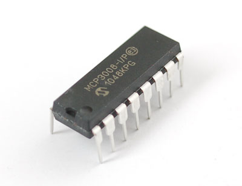
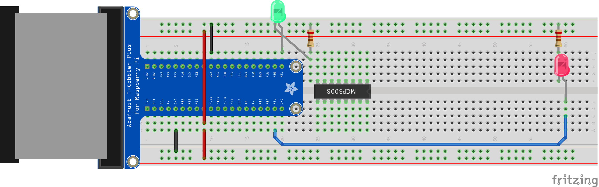
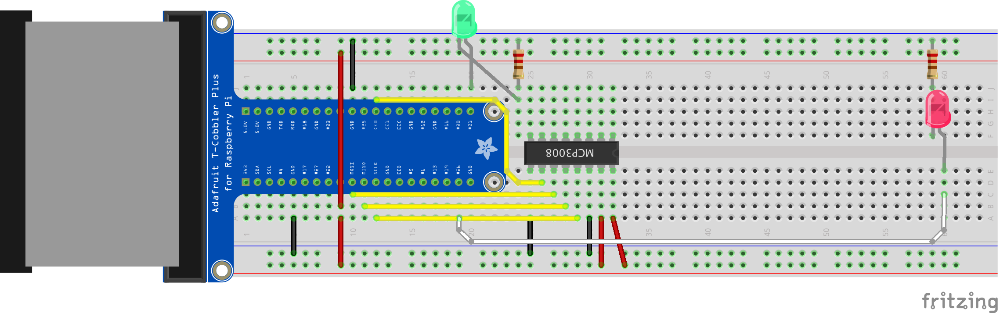
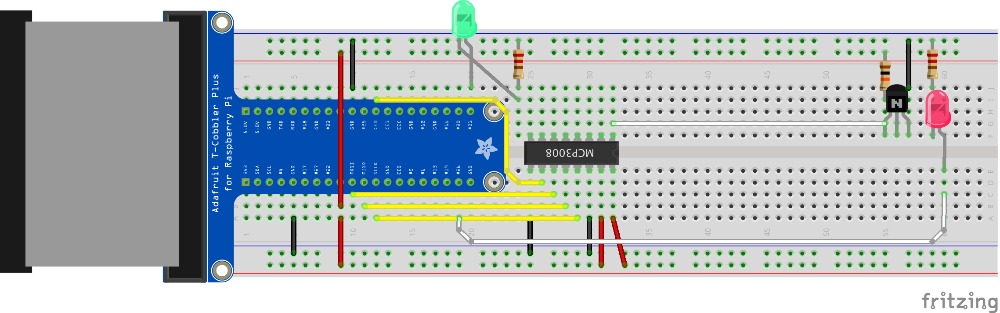
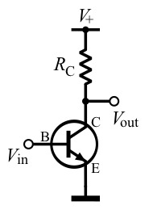
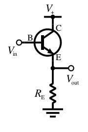

Raspberry Pi Pulsemeter
=======================

## Objectives
1. [How can our finger tell us our pulse?](../intro/index.md)
2. [Starting with blinky lights... and testing](01_LEDs.md)
3. **[The analog-to-digital (A/D) converter](02_A2D_converter.md)**
4. [Signal amplification](03_OpAmps.md)
5. [Maker Success!](04_Data.md)

## A warning about integrated circuits

Integrated circuits are pretty fragile to work with.  Getting them into the breadboard isn't too bad as long as you are careful.  Removing them from the board without a circuit puller generally results in bent pins and pierced thumbs. So let's get our A/D Converter in a good place the first time so we don't have to try to remove it!

Notice that these chips have a direction.  See the little half circle on one side?



## Placing the MCP 3008 where we want it...
For the sake of clean wiring, we will place the MCP 3008 A/D Converter a few rows away from the end of the cobbler **with the indented circle facing away from the cobbler.** Try to push the circuit in evenly.  If you are nervous, watch your neighbor first.  If you bend a pin, don't panic, an instructor can come by and help.




## Add wiring...

Once the A/D converter is in place, let's wire it up.  Again, the rails should use red and black wire.  You can pick a color for the other wires, but I highly suggest using the same color for all four A/D converter wires.  



## Add the phototransistor...

As the last step before we test things with code, we are going to plug in the phototransistor.  Be sure that the "emitter", the pin closest to the tab, is going to ground.  Also, if the breadboard is too stiff and the pins of the phototransistor just bend up instead of inserting into the board, use one of your jumper wires to loosen up the connection first.



## And now we test it!

Take a look at the code first in LeafPad.  The file is called ```p2_A2D_converter.py```.  We will talk through it in class.  After that, we'll run it.

```
sudo ./p2_A2D_converter.py
```

## Challenges
* In the current setup, we measure the voltage between the phototransistor and ground.  This is called a common emitter topology.  



What would happen if we had the resistor and transistor switch places, and we instead measured the voltage across the resistor (called a common collector setup)?



Which one of these setups will make the measured voltage go up when we cover up the phototransistor?  Why?


## Resources
* [MCP 3008 A/D Converter Datasheet](https://www.adafruit.com/datasheets/MCP3008.pdf)
* [Phototransistor Datasheet](http://www.alliedelec.com/images/products/datasheets/bm/OPTEK/70048591.pdf)
* [Wikipedia article on photodiodes (and phototransistors)](https://en.wikipedia.org/wiki/Photodiode)

----
| [<<Previous: Starting with blinky lights... and testing](01_LEDs.md) | [Signal amplification: Next>>](03_OpAmps.md) |
