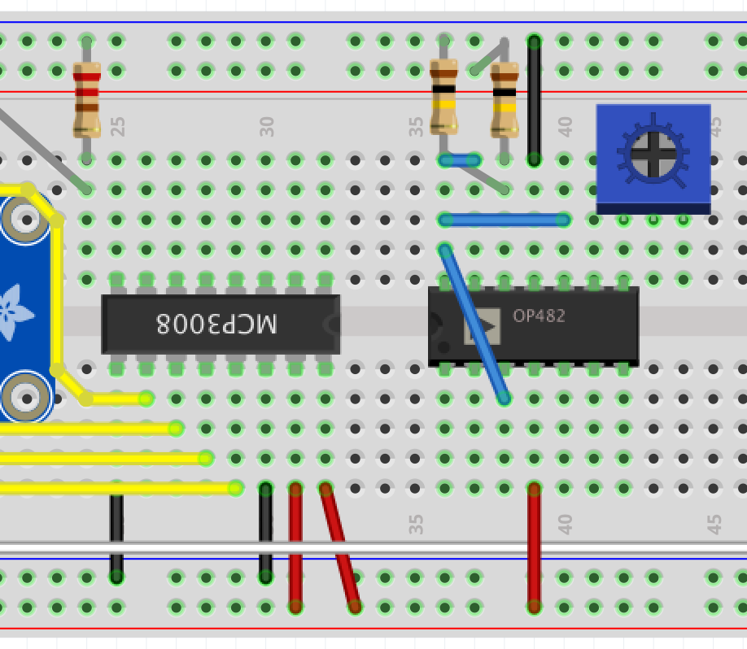
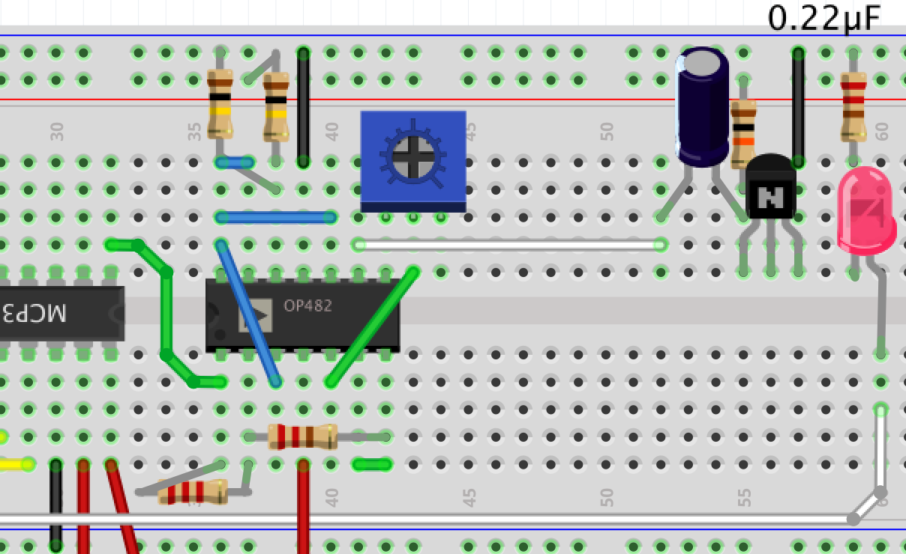
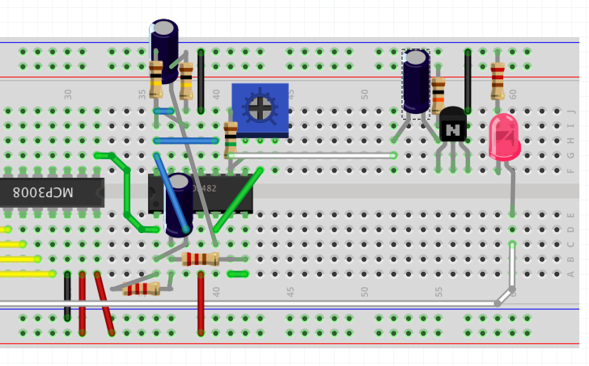
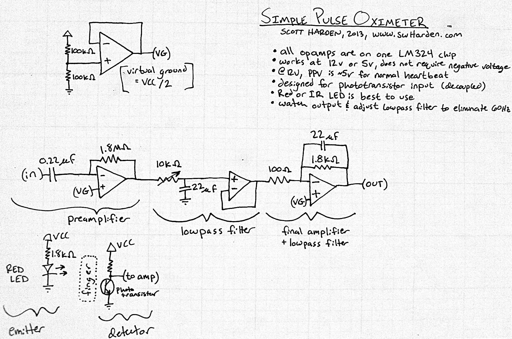

Raspberry Pi Pulsemeter
=======================

## Objectives
1. [How can our finger tell us our pulse?](../intro/index.md)
2. [Starting with blinky lights... and testing](01_LEDs.md)
3. [The analog-to-digital (A/D) converter](02_A2D_converter.md)
4. **[Signal amplification](03_OpAmps.md)**
5. [Maker Success!](04_Data.md)

## Oh, what a tangled web we weave...

We are about to add quite a few components to our board, and there is a big risk that while we do, we may short something, invert something, or otherwise do things we don't intend. So...

# Remove the connection between your breadboard and Raspberry Pi!

Once you are confident that things are wired up correctly, we will reconnect everything and try it out.  We will try to wire things up in a few steps to hopefully minimize errors and have intermittent checkpoints.

## Virtual ground

We are about to filter out low frequencies from our phototransistor.  This means that the constant DC voltage should go to "zero", which for a circuit is ground.  The pulsatile AC portion of the signal will then go above and below the ground voltage and be amplified several thousand times.  The only problem is that we are powering our rails with 3.3 Volts and 0 Volts as the reference points.  So there is no way for the "alternating" AC portion of the signal to dip below zero.  What we need is to shift things up so that the AC portion of the signal stays around the middle (1.667 Volts) and can fluctuate above and below that.

In electronics terminology, we want to make 1.667 Volts to be a "virtual ground".  We're used to picking the ground as the reference point and calling it zero.  It works because we are consistent.  In this case, we are going to pick a different reference point and be consistent with it.  For the ground wires, we are going to give them a special color (blue) so that we can remember what they do.

This next part has 2 10 kOhm resistors, a potentiometer, and about 5 wires that need to be placed.  Pair up with your neighbor and check each others' work.



## Amplifiers step 1

Hopefully so far so good.  Next we are going to add 4 more wires, 2 resistors, and one 0.22uF capacitor.  Pay attention to the oreintation of the capacitor.  




## Almost there!
We add the two 22uF capacitors and a 1 megaOhm resistor.  I'll show what I can on the document cam to supplement the drawings.  Also, be sure to help your neighbor and ask questions if there is doubt.



At this point, you are ready for the instructors to come around and check your work.  Once it looks good, you can reconnect your RasPi.

## What did we just do?

The circuit layout is borrowed from a DIY project posted a couple of years ago.  The schematic looks like this:


## Potentiometer
There is one component that you can tweak by design: the potentiometer (also called a trimmer in this case).  By turning the top with a screwdriver, you will change the resistance value.  It is part of a passive lowpass filter, and depending on how you set it, you will see changes in your signal.  If you turn it all the way down, you can probably see 60Hz noise from the lights.  Turn it all the way up, and you won't see your pulse very well.  Starting at about 30% is about right for testing.

## Time to troubleshoot

If you turn the Pi on and everything works as expected, that is fantastic, and also rare.  Any little wires touching or not pushed in far enough can cause your circuit to mysteriously fail.  The good news is that a multimeter can help a lot, and frankly, troubleshooting is a rich learning opportunity.  If your circuit works, find someone having trouble and help discover what is going on.

## Running the code
Our RasPi can see!  Let's take a look again at the code in LeafPad that will bring things to life.  The file is called ```pulse_plot.py```.  We will talk through it in class.  After that, we'll run it.

```
sudo ./pulse_plot.py
```

## Challenges
* You just did it! In the next section we'll start looking at data.

## Resources
* [Quad Op-Amp Datasheet](http://ww1.microchip.com/downloads/en/DeviceDoc/21733j.pdf)

----
[<<Previous: The analog-to-digital (A/D) converter](02_A2D_converter.md)
[Maker Success! Next>>](04_Data.md)
