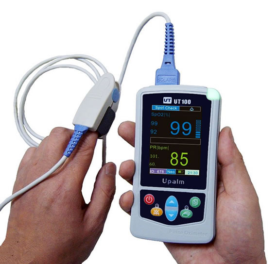
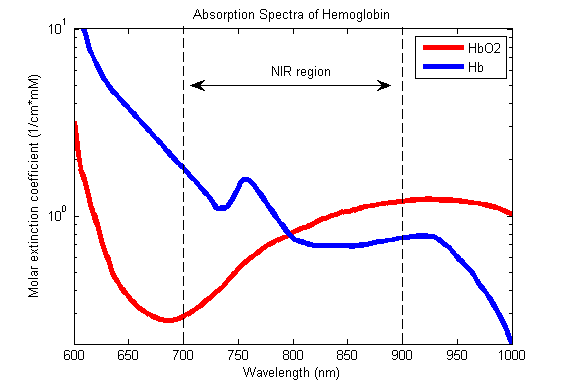
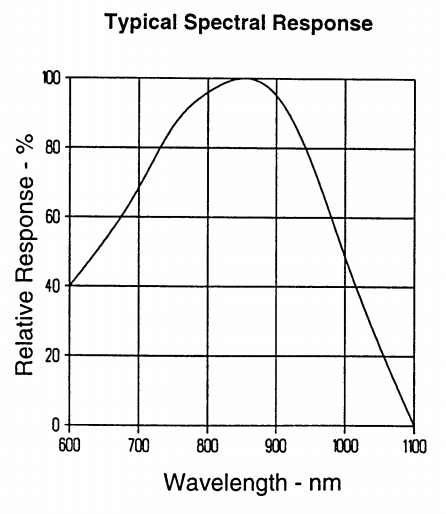

Raspberry Pi Pulsemeter
=======================

#### Objectives
1. **[How can our finger tell us our pulse?](index.md)**
2. [Starting with blinky lights... and testing](../build/01_LEDs.md)
3. [The analog-to-digital (A/D) converter](../build/02_A2D_converter.md)
4. [Signal amplification](../build/03_OpAmps.md)
6. [Maker Success!](../build/04_Data.md)

# Let us think this through...
##How can we detect our heartbeat using only our finger?
Usually we use listen for it.  The heart chambers pump and the valves snap closed.  This motion creates vibrations.  A stethoscope amplifies those vibrations to make it easy to hear.

What about blood in our finger?  There is blood flowing there (hopefully).  It should move in pulses as well as our heart pressurizes our arteries and pushes blood through the circulatory system.  How can we detect this?

We have probably experienced going to the doctor and having something like the image below on our finger.  Can anyone explain how it works?

#Spoiler...

#we can use light!

We can't detect it with our eyes, but the pressure wave from our heart beating makes it all the way to our fingers.  During the peak of the wave, more blood is in our finger tip.  If we pass light through our finger, we expect that the way that light is absorbed and refracted will change along with the bloodflow.  Some wavelengths of light work better than others, though.

Oh, and the the photodetectors we bought for you also have their own spectral response:

If we look at these absorption curves (along with the absorption curves of stuff we don't want extenguishing our signal, like melanin), we would settle somewhere in the infrared range as being perfect.  Inconveniently, though, we can't see infrared, so we are sticking with red for this class, the next best visible wavelength.  We have an IR LED around, though, and it works great with the exact same circuit.

## Oximetry

Most of the oxygen in our blood is carried by a tetramer protein called hemoglobin.  It turns out that that the optical properties of hemoglobin change quite a bit between the oxygenated and unoxygenated state, as shown in the chart just above.  If we measure absorption with two wavelengths of light, normalize the signals by their strength, and look at the ratios, it is actually possible to estimate how much of the hemoglobin is oxygenated.  While there is nothing particularly daunting about the mathematics behind it, it adds enough complexity to the circuit and especially the code that we won't be calculating oxygenation today.

## Challenge

Before moving on, think about a few things:

* What do you think your heartbeat will look like as detected by light in your finger?  
* What frequency (or frequencies) should we look for (in units of Hertz, a word derived from 'heart' in German)? Any frequencies that you expect will interfere with our measurement?
* How fast do we need to take measurements of the light to see it?

## Resources
* [Wikipedia article on Pulse Oximetry](https://en.wikipedia.org/wiki/Pulse_oximetry)
* [Oscilloscope based DIY Pulsemeter](http://www.swharden.com/blog/2013-04-14-simple-diy-ecg-pulse-oximeter-version-2/)
* [A really nice blogpost on a DIY pulsemeter circuit](http://embedded-lab.com/blog/?p=5508)
* [Newark online store for buying components](http://www.newark.com/)

----
[Starting with blinky lights... and testing :Next>>](../build/01_LEDs.md)
