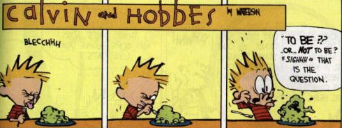

Introducing Python
==================

Python is a language for computer *scripts*.  Python, when given a text file (*script*) as input, will *execute* the actions described in the text file. Python works on practically any computer and is easy to learn. 

The purpose of this *Introduction* is so that you can understand and modify the Python scripts that will be used during the next two weeks 

#### Objectives
1. Read Python scripts
2. Run Python scripts
3. Edit Python scripts
4. Love Python scripts (extra credit)


## Let's start at the very beginning

When learning a new language, the first word learned is often “Hello”.  Similarly, when learning a new computer language, the first computer program written is “Hello world!” This is a computer program that, when run, will print to the screen `Hello world!`.  

In Python, writing this first program is very simple and a very good place to start. It uses the keyword **print**

```print "Hello world!"```

***Notice!*** Python recognizes the difference between uppercase and lowercase.  **print** is a keyword, however *Print* and *PRINT* are not keywords in Python.

Let’s go ahead and run this first program.  Open a terminal window.  Type:

```
cd
cd summer-2015/python_intro/python_examples
python 1_hello_world.py
```


#### Challenge

Use Python to say hello to the person on your right.    

1. For convenience, you already have the example scripts. Open the file *1_hello_world.py* in Leafpad.  First start Leafpad by finding *Text Editor* in the *Menu* under *Accessories*.  Then open the file by selecting *Open* under the *File* menu.  A file selection browser will pop-up.  Select on the left *pi* then select the *summer-2015* folder, then select the *python_intro* folder, then select the *python_examples* folder and finally select *1_hello_world.py*.
2. Make your change and save the file.
3. To run the script, type `python 1_hello_world.py` into the terminal.  Here is a time-saving tip!  If you type `python 1` and then press the *Tab* button on the left side of your keyboard, the terminal will type of rest of the filename for you.

#### What you learned

1. How to use the keyword **print**.
2. How to view, edit, and run a Python script.
3. Python is case-sensitive.
4. How to use *Tab* in the terminal to automatically finish typing a filename or foldername.


## This time with variables

In algebra, you learned that a **variable** is a quantity that can change within the context of a mathematical problem, and is represented by a single letter.  For example, x = 3 + y.

In programming, *information* can be assigned to a **variable**, and variables are identified by one or more letters.

Let us take a look at Hello world again, this time with variables.

```
greeting = "Hello"

name = "world"

salutation = greeting + " " + name + "!"

print salutation
```

***Notice!*** Computer scripts execute from top to bottom, just like we read text.  Importantly, variables should be assigned information before a script asks for the information with the variable.

***Notice!*** Variable names can not have spaces.

So here is how the script runs:

*greeting* is assigned the information "Hello" using the **=** symbol.

*name* is assigned the information "world”.

The quotes indicate that the type of the information is a **string**.  A string is a list of characters such as numbers, letters, and symbols.

Then, *salutation* is assigned the combination of *greeting*, a space, *name*, and an exclamation mark.

Multiple strings can be combined into one string using the plus symbol, **+**

Finally, the information in *salutation* is printed to the screen.


Go ahead and type `python 2_hello_world_again.py` into the terminal to see if it runs as expected.


#### Challenge

Update this script to say hello to the person on your left by changing the information stored in  *name*, then run again.

#### What you learned

1. How to assign information to a variable.
2. What a **string** is.
3. How to combine strings.
4. A script reads and runs from top to bottom
5. A variable needs to associate with information before using the variable


## Putting the “fun” into function

When performing essentially the same set of actions repeatedly, you can create a *function* for these set of actions. Because computers are generally used to perform repeated tasks, we are almost always creating a lot of functions.  This results in less coding and less editing, which in turn is more reliable and efficient.


Functions in Python start with the keyword **def** which is short for define, followed by the name of the function, then a set of parentheses which may or many not have input variable names inside of them, and finally a colon **:**.  

Input variables allow the actions of the function to be different, depending on the information sent to the function when it is used.

Defining a function does not cause it to run.  It just lets Python know what to do when the function is run.  Functions have to be defined before being called upon to run.

```
def greet( name ):
    print "Hello " + name + "!"
    print "Nice to see you."
    print "Thank you for coming to CODE@TACC."

greet( "world" )
greet( "friend" )
```

***Notice!*** The print statements are part of the function *greet*, and they are indented using **4 spaces**.  Python relies on indenting to determine which lines are part of the function.  

***Notice!*** Like variables, function names can not have spaces.

Go ahead and type `python 3_function.py` into the terminal.

What happened?  

First the function *greet* is defined.  Next, the function *greet* is called with "world" as an input.  Because of this, the variable *name* is given the information "world".  Finally, the function *greet* is called with "friend" as an input.  

#### Challenge

Add `print "I look forward to seeing you tomorrow!”` to the function *greet*.

Update the script to greet the people sitting to your left and right by name.

#### What you learned

1. Functions are used for any task that is repeated.
2. How to define a function in Python.
3. How to send information to a function.
4. Functions need to be defined before being called upon.


## I got a blank space and I’ll write your name

Functions not only perform tasks, but can be used to **return** results.  Using the keyword **return** in a function will cause information to output from the function.  


Go ahead and type `python 4_input.py` into the terminal.  When prompted, type in the answer to the question and *Enter*.

Let’s look at the script.

```
def get_name():
    typed_name = raw_input( "What is your name? ")
    return typed_name

def greet( name ):
    print "Hello " + name + "!"

your_name = get_name()

greet( your_name )
```

In this example, the function *get_name* outputs the information of the variable *typed_name*

***Notice!*** The keyword **return** will cause the function to stop.

Also note that the function *get_name* has no input.  

The variable *result* is assigned the information that you type in when prompted by the built-in function **raw_input**.

**raw_input** lets you create a new string using your keyboard while the script is running.

#### Challenge

1. Add a new function to the script called *get_favorite_color* that uses **raw_input** and returns a string.
2. Add a line that calls your new function after the line that calls *get_name()*
3. Incorporate the favorite color into the function *greet*.

#### Example solution

```
def get_name():
    typed_name = raw_input( "What is your name? ")
    return typed_name

def get_favorite_color():
    typed_color = raw_input( "What is your favorite color? ")
    return typed_color
                            
def greet( name, color ):
    print "Hello " + name + "!"
    print "I also like the color " + color + "."
                            
your_name = get_name()
your_favorite_color = get_favorite_color()
greet( your_name, your_favorite_color )
```

#### What you learned

1. Functions can return information.
2. A function will end if it performs a **return**. 
3. **raw_input** converts input from keyboards into a **string**


## Basic math

Raspberry Pi is can do math.

Go ahead and type `python 5_math.py` in the terminal.

```
print ""
print "Basic Math Operations"
print ""
print "4 + 3 is " + str( 4 + 3 )        # Addition, 4 plus 3
print "4 - 3 is " + str( 4 - 3 )        # Subtraction, 4 minus 3
print ""
print "4 * 3 is " + str( 4 * 3 )        # Multiplication, 4 times 3
print "4 ** 3 is " + str( 4 ** 3 )      # Exponentiation, 4 to the 3rd power
print ""
print "4 / 3 is " + str( 4 / 3 )        # Division, 4 divided by 3. Rounds down to integer
print "4 % 3 is " + str( 4 % 3 )        # Modulo, remainder of 4 divided by 3
print ""
print "4.0 / 3 is " + str( 4.0 / 3 )	# Division, 4 divided by 3, not rounded
print ""
# your_number = raw_input( "Enter a number: " )     
# answer = float( your_number ) * 3 + 2
# print "Your result is " + str( answer )
```

***Notice!*** The **#** symbol indicates that the following text in the line should be ignored.  One use of this is to add a comment to the script that helps explain the script to others.  Another use of **#** is to disable specific lines of the script.

***Notice!*** A number must be converted into a string using build-in function **str** before being combined with a string.  Convert a string to an integer using **int** and to a decimal using **float**.

If you are working with integers, Python keep answers as integers by rounding down. To force Python to use decimals, put decimals into your numbers.

#### Challenge

Enable the last 3 lines of the script and run it again.

#### What you learned

1. Using Python to do basic math.
2. How to force Python to use decimals in calculations.
3. How to use comments.
4. Converting numbers into strings, and strings into numbers.


## To be or not to be



Sometimes you just need a *yes* or a *no* answer to a question.  In Python, *yes* is represented as **True**, while *no* is represented as **False**.  

Go ahead and type `python 6_compare.py` into the terminal.

```
print ""
print "Comparisons"
print ""
print "4 > 3 is " + str( 4 > 3 )	# 4 greater than 3
print "4 < 3 is " + str( 4 < 3 )	# 4 less than 3
print "4 == 3 is " + str( 4 == 3 )      # 4 equal to 3
print "4 >= 3 is " + str( 4 >= 3 )      # 4 greater than or equal to 3
print "4 <= 3 is " + str( 4 <= 3 )      # 4 less than or equal to 3
print "4 != 3 is " + str( 4 != 3 )	# 4 not equal to 3
print ""
print "Combining comparisons"
print ""
print "not True is " + str( not True )
print "not False is " + str( not False )
print ""
print "True and True is " + str( True and True )
print "True and False is " + str( True and False )
print "False and False is " + str( False and False )
print ""
print "True or True is " + str( True or True )
print "True or False is " + str( True or False )
print "False or False is " + str( False or False )
print ""
print "not ( False or (False and True) ) is " + str( not ( False or (False and True) ) )
```

***Notice!*** Capitalize the first letter of **True** and **False**.

We see in this example the basic ways to compare two numbers.

At times, we need to take an action only if the result is **False**.  We can turn **False** into **True** with **not**.

Sometimes, we need to do more than one comparison, and only take action if both results are **True**.  To do this, we use the operator **and**.

Other times, we may need to take an action if either result is **True**.  To do this, we use the operator **or**.

Knowing if something is **True** or **False** can be useful when making decisions, as we will see in the next section.

####  What you learned

1. Using **>**, **<**, **==**, **>=**, **<=**, and **!=** to perform comparisons.
2. Operators **and**, **or**, and **not**.


## If, elif, else

Now that we know how to compare, we can evaluate situations and take different actions accordingly.  To do this, we ask the question **if**.  

```
if result:
    do something if result was True	
else:
    do something different if result was False
```

Sometimes you want to have more than two possible options.  You can use **elif** (which means *else if*) with **if** to do this.  


```
if first_result:
    do something if first_result was True	
elif second_result:
    do something if first_result was False and second_result was True	
else:
    do something different if first_result was False and second_result was False
```

In the example that follows, the built-in function **len** returns the number of characters in a string.  

```
my_name = "Raspberry Pi"
print "My name is " + my_name

your_name = raw_input( "What is your name? " )

# Check to see if your_name was entered
if len( your_name ) == 0:
    # name was not entered
    print "I really would like to know your name."
    your_name = raw_input( "What is your name? " )

# Compare length of your_name to my_name
if  len( your_name ) > len( my_name ) :
    print "Oh, what a long name you have"
elif len( your_name ) < len( my_name ) :        # elif is python for 'else, if'
    print "Oh, what a short name you have"
else:
    print "Your name is the same length as my name"
```

Go ahead and type `python 7_if.py` into the terminal.  See what result you get when you type in your name.

***Notice!*** You can have up to 1 **else** with an **if**. You can have as many **elif** as your need.

#### What you learned

1. How to use **if**, **elif**, and **else**.
2. What **len** does with strings


## I really really really really really really really like loops

Computers can do the same task over and over and never get bored.  Python has two types of loops: **for** loops and **while** loops.


A **for** loop takes a list of information, and assigns the information in the list one at a time to the variable.  A shopping list is an example of this.  A shopper could go through the list from top to bottom, and one at a time find the items on the list.

Here is the basic syntax of a **for** loop.  The keywords are **for** and **in**.  Note the use of the colon. 

```
for item in list:
    some_action
```

Lists are represented using brackets, **[ ]**, and commas between the different informations.

A convenient way to create a list of numbers is to use the built-in function **range**.

Go ahead and type `python 8a_for_loop.py` into the terminal.

```
shopping_list=["apple","orange","eggplant","avocado"] 

for item in shopping_list:
   print "I am looking for an " + item

print ""
print "range( 5 ) is = " + str( range( 5 ) )
print ""

# 'for' sets a variable to each value in a list
for x in range( 5 ):
    print "x is now " + str(x)
```

***Notice!*** The function **range** creates a list of numbers starting at 0.  The final number is one less than the input to range.

A **while** loop will repeat as long as the criteria is **True**.

```
while this_is_True:
    some_action
```

Take a look at the following script.  What will it do?

```
haters_gonna_hate = True

shakes=0

print "I'm just gonna..."

while haters_gonna_hate:
    print "shake"
    shakes = shakes + 1
    if shakes >= 5:
        haters_gonna_hate = False
```

Go ahead and type `python 8b_while_loop.py` into the terminal.

***Notice!*** The last line of script had a double indent, so 8 spaces.  Why? The line is inside an **if**, which is inside a **while**.

#### Challenge 

Python treats strings as a **list** of individual characters.  What would you expect the following script to do?

```
your_name = raw_input( "What is your name? ")
for each_character in your_name:
    print each_character
```

#### What you learned

1. How to generate a list of numbers using **range**
2. How to use **for** loops
3. How to use **while** loops


## The end is near


While Python has many built-in functions like **range** and **len**, one can using keyword **import** to bring in even more functions. 

```
import time                 # imports functions from a library called time

print "Going to sleep for 5 seconds....Zzzzzzz"

start_time = time.time()    # time.time() returns the number of seconds since Jan 1, 1970
time.sleep(5)               # waits 5 seconds
stop_time = time.time()

nap_time = stop_time - start_time

print "I actually slept for " + str( nap_time ) + " seconds."
```

Go ahead and type `python 9_import.py` into the terminal.  How accurate was the length of the nap?  

You may see **import** used in other ways, but they basically do the same thing, with minor changes in syntax.

```
import time
from time import timelords
import time.timelords as doctors
```

Final point. You may see functions accessing *methods* using a period. What do you think the script below does?

```
# get direct access to the datetime library
from datetime import datetime

current_time = datetime.now()

print "The year is " + str( current_time.year )
print "The month is " + str( current_time.month )
print "The day is " + str( current_time.day )
print "The hour is " + str( current_time.hour )
print "The minute is " + str( current_time.minute )
print "The second is " + str( current_time.second )
```

#### What you learned

1. Accessing more functions using **import**
2. How to measure time elapsed
3. How to add a delay to your script

## Go forth with confidence


#### Congratulations

You now know how to read, run, and edit Python scripts.  If you need to review, come back and take a look anytime.

#### Additional resources 

If you want to take it your Python knowledge to the next level, I highly recommend the following free online class.

[Python at Code Academy](http://www.codecademy.com/en/tracks/python)

#### Next

[**Day 1 Schedule**](../README.md#day-1)


