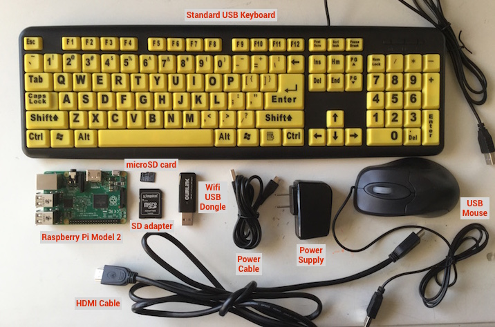
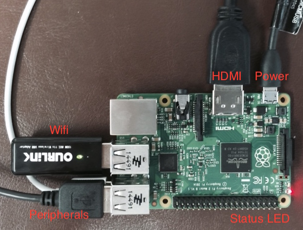
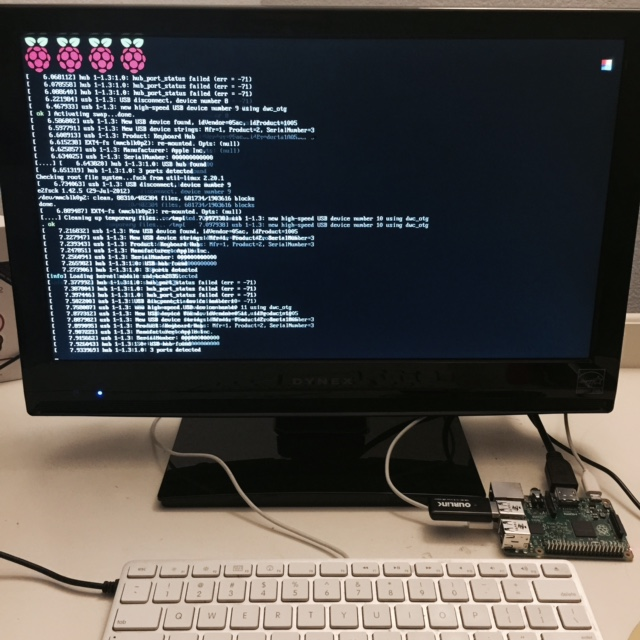

Getting Started with Raspberry Pi
=================================

#### Objectives
1. **[Build a tiny computer](01-build.md)**
2. [Set it up just so](02-configuring.md)
3. [Explore the Raspbian desktop](03-raspbian-desktop.md)
4. [Learn a little Linux](04-linux-101.md)
5. [Update and install software](05-apt-get.md)

# Building a tiny computer

[What is a Raspberry Pi?](https://vimeo.com/90103691) from the [Raspberry Pi Foundation](https://vimeo.com/raspberrypi)

The Raspberry Pi is a low cost, credit-card sized computer that plugs into a computer monitor or TV, and uses a standard keyboard and mouse. It is a capable little device that enables people of all ages to explore computing, and to learn how to program in languages like Scratch and Python. It’s capable of doing everything you’d expect a desktop computer to do, from browsing the internet and playing high-definition video, to making spreadsheets, word-processing, and playing games. What’s more, the Raspberry Pi  has the ability to interact with the outside world, and has been used in a [wide array of digital maker projects](http://www.pcworld.com/article/2895874/10-insanely-innovative-incredibly-cool-raspberry-pi-projects.html), from music machines and parent detectors to weather stations and tweeting birdhouses with infra-red cameras!

:star: You're going to build one today and use it for the next two weeks!

## Overview of your Raspberry Pi kit

| Part | Notes |
|------|-------|
| Raspberry Pi Model 2 | A tiny machine made just for tinkering |
| HDMI cable | In addition to computer monitors, you may use any TV that has HDMI input as a screen |
| Micro-USB Power Supply & Cable | A Micro USB charger can be used as long as its specs are 5V and at least 1.0A |
| Ourlink Wifi Adapter | There are many USB Wifi adapters but this is widely considered to be the best for Raspi |
| Keyboard and Mouse | You can use any USB keyboard and mouse, but you may need to update the Raspi's keyboard configuration |
| MicroSD card | This card has been formatted to contain a Raspberry Pi operating system |
| Electronics Package | These items will be discussed separately |

## Put it all together

* Plug in the keyboard, mouse, and wifi adapter into any three USB ports
* Insert the microSD card into the card slot on the bottom side of the Pi. The lettering on the card should be facing outwards so you can read it.
* Connect the HDMI cable between the Pi and the monitor. Turn on the monitor.
* Plug in the USB power supply into the power strip
* Connect the power supply to the Pi microUSB power input

**:red_circle: The status LEDs on the Pi should light up**

**On the monitor, you will see a lot of text scroll by. This is the computer "booting up"**

#### What you learned
* What the various connection ports are for on a Raspberry Pi computer
* Assembling and powering up a Raspberry Pi computer

## Challenges
* None

## Resources
* [What is Raspberry Pi](https://www.raspberrypi.org/help/what-is-a-raspberry-pi/)
* [Shop for Raspberry Pi and accessories](http://www.adafruit.com/category/105)
* [Materials List for "Getting Started with Raspberry Pi"](10-materials.md)

#### Next Objective
1. [x] [Build a tiny computer](01-build.md)
2. **[Set it up just so](02-configuring.md)**
3. [Explore the Raspbian desktop](03-raspbian-desktop.md)
4. [Learn a little Linux](04-linux-101.md)
5. [Update and install software](05-apt-get.md)
