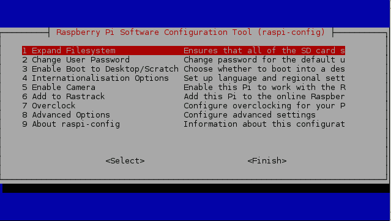
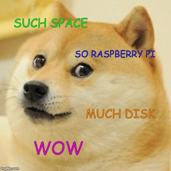
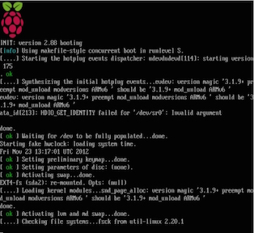
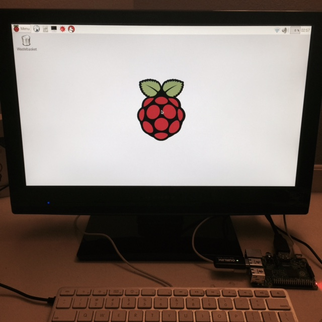
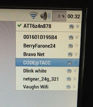
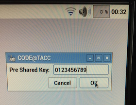
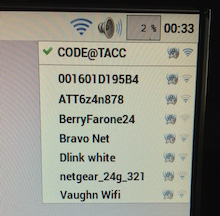

Getting Started with Raspberry Pi
=================================

#### Objectives
1. [Build a tiny computer](01-build.md)
2. **[Set it up just so](02-configuring.md)**
3. [Explore the Raspbian desktop](03-raspbian-desktop.md)
4. [Learn a little Linux](04-linux-101.md)

# Configuring the Raspberry Pi

The Raspberry Pi operating system needs a few hints, provided by you, as to how it should behave. If you have used a PC computer before, this is similar to changing settings in the BIOS.

## Introducing Raspi-config

When you first boot up, the system will launch **raspi-config**

**Raspi-config** is a text-based application, so you can't use your mouse to navigate. Instead, use the **Arrow** and **Tab** keys to move between fields, **Return** to select, and use **Esc** to cancel. You can always get back to the main page by tapting Esc a couple of times!

:star: You can access this screen in the future to make other changes by typing `sudo raspi-config` in any Terminal window (more on Terminals later...)

### Expand the file system

The Raspbian operating system takes up just a small portion of the available storage space, but we don't start off knowing how big of a disk it was installed on. So, the first time we boot up from a new SD card we need to let the system know how much room there is for programs and doge pics.

* Move the red cursor to **1 Expand Filesystem** using the arrow keys and tap **Return**. You should see a message go by the the filesystem will be enlarged next time you reboot. Simple right?

### Booting to a Graphical Desktop

Some systems launch to a powerful text interface by default because this saves precious memory and processor power. For now, we want to make sure the Raspi starts up in a friendly desktop environment.

* Move the red cursor to **3 Enable Boot to Desktop/Scratch**, tap **Return**, and select **Desktop Log in as user 'pi' at the graphical desktop**. tap **Return**.

### Setting Timezone and Keyboard Type

Raspberry Pis are British computers and as such default to Greenwich Mean Time (GMT) and a UK keyboard layout. The former will make the Pi think its 5-6 hours later than it is and the latter will make some of your keys act funny when using an American keyboard.

* Move the red cursor to **4 Internationalisation Options**, tap **Return**, select **I2 Change Timezone**, and tap **Return** again.
* After a brief pause, you will see a menu called **Configuring tzdata**. Select **US** and then **Central**, then tap **Return**
* From the main **raspi-config** page, choose **4 Internationalisation Options** again. This time, select **I3 Change Keyboard Layout** then make the following selections:
	* Keyboard model: Generic 101-key PC
	* Keyboard layout: English (US)
	* Key to function as AltGr: The default for the keyboard layout
	* Compose key: No compose key
	* Use Control+Alt+Backspace to termine the X server: Yes

### Renaming your Pi

Out of the box, all Pis are named **raspberrypi** on the network. This COULD get confusing, so you are going to give your Pi its own unique name.

* Move the cursor to **8 Advanced Options**, tap **Return**, then navigate to **A2 Hostname** and tap **Return** again. Read the message about valid characters, tap **Return** one more time.
* Enter a new name for your Pi in the box labeled "Please enter a hostname". When you're ready to end, use **Tab** to navigate to the **OK** field and tap **Return**

#### Rules of the Road

1. You can only use the characters a-z, 0-9, and the hyphen
2. Try to keep your names short because you and others will have to type them
3. :exclamation: All names used in our workshop have to be appropriate for a classroom setting

### Enabling SPI

SPI is a special interface that will be used later in the workshop. We need to turn it on in **raspi-config**.

* Go to **8 Advanced Options** again and tap **Return**. Select **A6 SPI** and when asked if you would like the SPI interface to be enabled, select **Yes**. When asked if you would like the SPI kernel module to be loaded by default, again select **Yes**.

### Enabling I2C

I2C is a special interface that will be used later in the workshop. We need to turn it on in **raspi-config**.

* Go to **8 Advanced Options** again and tap **Return**. Select **A7 I2C** and when asked if you would like the I2C interface to be enabled, select **Yes**. When asked if you would like the I2C kernel module to be loaded by default, again select **Yes**.

### Enabling SSH

[Secure Shell](http://en.wikipedia.org/wiki/Secure_Shell) is a very secure way for one to access a remote computer over the Internet. Instead of interacting with that computer by typing on its keys and reading its screen, your local computer takes over control. We will show you how to use SSH later in the workshop, but for now let's just turn it on because we are going to need it.

* Go to **8 Advanced Options**, tap **Return**, select **A4 SSH**, and tap **Return** again. When asked "Would you like the SSH server enabled or disabled?" select **Enabled**, please. 

:star: If a Raspberry Pi computer is connected to the Internet and has SSH turned on, anyone who knows a username and password for that computer can log into it and run commands. Good safety practices for operating an SSH server include [changing the password](http://www.tldp.org/LDP/lame/LAME/linux-admin-made-easy/changing-user-passwords.html) for the pi (or other) user before making it available over the Internet.

### Disabling the Serial Console

Normally, one can log into a Raspberry Pi by connecting two wires on its main board to a USB connection on another computer via a **serial** connection. However, we need this function to be turned off for another project later in the workshop to work correctly. 

* Go to **8 Advanced Options**, tap **Return**, select **A8 Serial**, and tap **Return** again. When asked if you would you like a login shell to be accessible over serial, select **No**

### Restarting

Most of the changes you made won't take effect until the computer restarts. So, let's do that now from within **raspi-config**

* Navigate the cursor to **Finish** and tap **Return**

**Watch the system restart. It should only take a few seconds.**

**The Raspbian desktop will appear after you reboot from raspi-config**

## Connecting to Wifi

There's a lot of corners to explore on the Raspbian desktop, but the first thing most folks want to do is connect to the Internet. If you have access to a wired, or **Ethernet**, network you can connect to it via the **Ethernet Port** on the Raspi using a cable. Most of us use wireless, or **Wifi** connections and so shall we in our workshop. 

* In the top right corner of the screen, click on the networking icon. It will either look like a pair of computers or a common "Wifi" signal icon. 

**Select the CODE@TACC network. You will not have access to the others.**

* Enter either this access key **0123456789** or one provided to you by the instructors

**If you entered the key correctly, when you click on the Wifi icon, it will show your Raspi to be connected to the CODE@TACC network**

# What you learned
* Navigating inside a "screen-based" application
* Finding and configuring various options inside **raspi-config**
* Renaming a Raspberry Pi
* Connecting a Raspberry Pi to a Wifi internet connection

# Challenges
* None

# Resources
