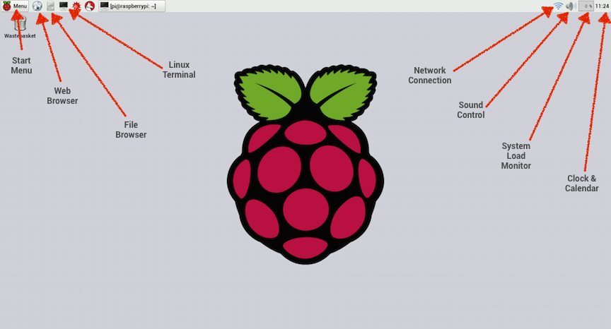
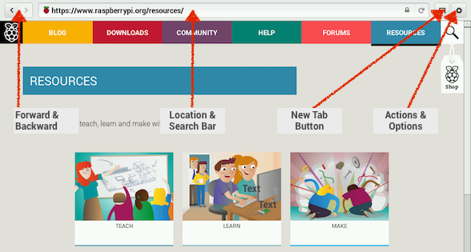
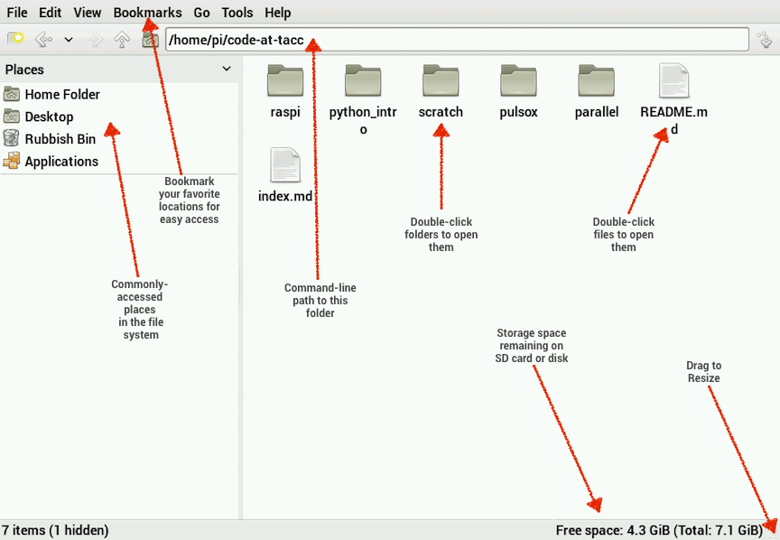
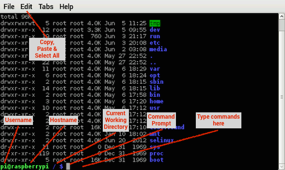
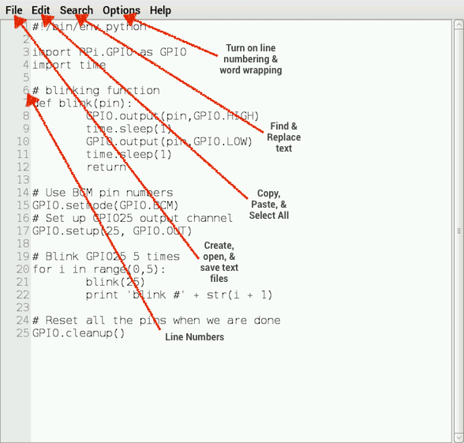
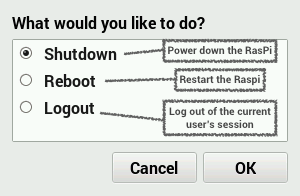

Getting Started with Raspberry Pi
=================================

#### Objectives
1. [Build a tiny computer](01-build.md)
2. [Set it up just so](02-configuring.md)
3. **[Explore the Raspbian desktop](03-raspbian-desktop.md)**
4. [Learn a little Linux](04-linux-101.md)
5. [Update and install software](05-apt-get.md)

# Explore the Raspbian desktop

#### Desktop

The graphical desktop is similar in many aspects to what you find with Windows of Mac.  The different icons and features are highlighted here.



In particular, the *Menu* allows access to almost all installed software with graphical interfaces, including *Programming*, *Accessories*, and *Preferences*.

#### Web browser

The default web browser on the Raspberry Pi is called *Epiphany*.  It is similar in capability to other standard web browsers such as Internet Explorer, Safari, Chrome, and Firefox. The key buttons and their actions are marked.



#### File browser

When looking around for files on your Raspberry Pi, you can use the *file browser*.  Like both Mac and Windows, you can see icons for folders and files and can double-click folders to open them for viewing or double-click files to open the file in an appropriate program.

* Opening the file browser is a convenient way to see how much space you have on your SD card.
* It also gives you a simple text summary of which folder/file you're viewing, called the `command-line path`. We’ll talk more about the [command-line path](04-linux-101.md#path) in a little while.



#### Terminal

Similar to the *file browser*, the *terminal* allows you to explore files and folders.  However, the terminal does not have a graphical interface. Instead you type `text` commands to control the computer. This is an advantage when working with programs that also do not have a graphical interface.  We will learn more about [using the terminal](04-linux-101.md) in a little while.



#### Text editor

You can create and edit text files using the *Text Editor* called Leafpad.  To access Leafpad, click the *Menu* icon and select *Accessories* and then select *Text Editor*.



Turning on *Line Numbers* can be helpful when working with computer code.  You can turn it on through the *Options* menu in Leafpad.

#### Turning off

Through the *Menu* you can access the *Shutdown* options.  Here you can elegantly power down the Raspberry pi, reboot, or simply logout.



#### Challenges

1. Use Leafpad to create a new file and save it to your Desktop
2. Open up this page in your web browser
3. Make a local copy of this website (called a *git repository*) onto your computer. First, open the terminal.  Then, copy the following line from your web browser and paste it into the terminal. Press *Enter*
```
git clone https://github.com/CODE-at-TACC/summer-2015.git
```

#### What you learned

1. How to access the web browser and go to a website.
2. How to use the file browser to explore the contents of your SD card.
3. How to open and save files.
2. Shut down, restart, or log out .
4. How to access the terminal.
5. How to use `git clone`.

## Resources

* [Using Raspberry Pi 2 as a Desktop Computer](http://www.element14.com/community/docs/DOC-74513/l/can-the-raspberry-pi-2-replace-your-desktop-computer)
* [Materials List for "Getting Started with Raspberry Pi"](10-materials.md)


#### Next Objective
1. [x] [Build a tiny computer](01-build.md)
2. [x] [Set it up just so](02-configuring.md)
3. [x] [Explore the Raspbian desktop](03-raspbian-desktop.md)
4. **[Learn a little Linux](04-linux-101.md)**
5. [Update and install software](05-apt-get.md)


