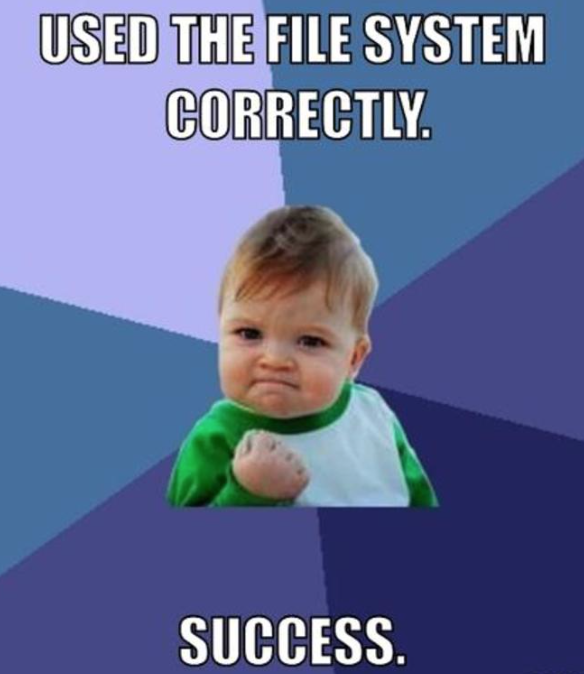

Getting Started with Raspberry Pi
=================================

#### Objectives
1. [Build a tiny computer](01-build.md)
2. [Set it up just so](02-configuring.md)
3. [Explore the Raspbian desktop](03-raspbian-desktop.md)
4. **[Learn a little Linux](04-linux-101.md)**
5. [Update and install software](05-apt-get.md)

# Learn a little Linux

The purpose of this section is to present basic terminal commands that will be used during CODE@TACC.

## Navigating the filesystem

The part of the operating system responsible for managing files
and directories is called the **filesystem**.

It organizes our data into files, which hold information, and directories
(also called "folders"), which hold files or other directories.

Several `text` commands are frequently used to create, inspect, rename,
and delete files and directories.

### Where am I?

To start exploring them, let's [open a terminal window](03-raspbian-desktop.md#desktop):

```
$
```

The dollar sign is a prompt, which shows us that the terminal shell is waiting for input.

input is generally in the form of a text command, often with some extra options that change how the command acts:
```
$ command -options -other_options
```

Let's find out where we are by running a command called `pwd`
(which stands for "print working directory").

```
$ pwd
/home/pi
```


Let's have a quick look at how the file system as a whole is organized.
At the top is the *root* directory that holds everything else.
We refer to it using a slash character `/` on its own.

Inside the root directory are several other directories:
* `bin` (which is where some built-in programs are stored),
* `data` (for miscellaneous data files),
* `home` (where users' personal directories are located),
* `tmp` (for temporary files that don't need to be stored long-term),

and so on.

#### Path
`pwd` tells the us the *path* to our current working directory is `/home/pi`.
This *path* tells us `/home/pi` is stored inside `/home`
because `/home` is the first part of its name.
Similarly, we know that `/home` is stored inside the root directory `/`
because its name begins with `/`.

> Notice that there are two meanings for the `/` character.
> When it appears at the front of a file or directory name,
> it refers to the root directory. When it appears *inside* a name,
> it's just a separator.

### What’s here?

We can *list* what is inside our current directory by using the `ls` command:

```
$ ls
```

`ls` prints the names of the files and directories in the current directory in alphabetical order,
arranged neatly into columns.

We can make its output more comprehensible by using the option flag `-F`,
which tells `ls` to add a trailing `/` to the names of directories.

```
$ ls -F
```

### Going somewhere?

We can *change directory* using `cd` followed by a directory name.  This will change our location to a different directory.

```
$ cd python_games
```

`cd` doesn't print anything, but if we run `pwd` after it, we can see where we are now.
If we run `ls`, it lists the contents of where we are now.

```
$ pwd
$ ls
```

We now know how to go down into a directory.
How do we go up and out of our current directory?

It’s simple to use `cd ..` to go up one level:

```
$ pwd
$ cd ..
$ pwd
```

`..` is a special directory name meaning
"the directory containing this one", or, "the parent of the current directory".

Another option when changing directories is to list the complete *absolute* path starting with root directory `/`

```
$ cd /home/pi/Desktop
```

If you type `cd` by itself, you will go into your home directory.

#### Challenge

1. Discover the path of your home directory

#### What you learned

1. How to find what directory you are in using `pwd`
2. Using `ls -F` to list files in your current working directory
3. Changing directories
4. How to get to your home directory


## Creating and deleting files and directories

We now know how to explore directories and files, but how do we create new ones?

Go ahead and create a new directory called `my_scripts` using the command `mkdir my_scripts`.

```
$ cd
$ mkdir my_scripts
```

As you might (or might not) guess from its name, `mkdir` means *make directory*.
Since `my_scripts` has a relative path (i.e., doesn't have a leading slash),
the new directory is made below the current working directory:

```
$ ls -F
```

However, there's nothing in it yet:

```
$ cd my_scripts
$ ls -F
```

To create an empty file, you can use the command `touch`.

```
$ touch draft.txt
$ ls -F
```

At this point, you want to make a backup of this *very* important empty file.  You can use `cp` to make copies of files or directories

```
$ cp draft.txt draft2.txt
$ ls -F
```

You can see that the command `cp` took two filenames.  The first one was the existing file, the second was the new file.

If you decide that `draft2.txt` is not the best name for a backup file, you can change its name using the `mv` command which moves the file to a new name.

```
$ mv draft2.txt draft_backup.txt
$ ls -F
```

As *move* implies, it can also be used to actually move the file someplace else.  For example, if we do not want the backup file in this directory, we can move it away by indicating the *new path* before the name:

```
$ mv draft_backup.txt ../draft_backup.txt
$ ls -F
```

Based on what you know from `cp`, can you see how `mv` works? Where is the draft_backup.txt file now?  Can you find it?

```
$ cd ..
$ ls -F
```

Okay, now that we have made a mess with empty files and directories we do not actually need, let’s clean up.

***Notice!*** Deleting Is Forever :skull:

```
$ rm draft_backup.txt
$ ls -F
```

`rm` is short for "remove”. It works on files, but not directories.  For directories, you can use `rmdir`.

For safety purposes, `rmdir` only works on empty directories.  Because we left a file in the folder *my_scripts*, the following command will not work.

```
$ rmdir my_scripts
```

To override this, you can use `rm -r`.  Please be careful with this command, and only use it on directories that you are certain have nothing you wish to keep.

```
$ rm -r my_scripts
$ ls -F
```

The `-r` in this case indicates that the command is *recursive*, which means it will delete all files and subdirectories and their files and subdirectories and so on and so on.  As you can imagine, this could be a lot of files.

#### Challenges

1. In the last section, you used `git clone` to make a local copy of the *summer-2015* website repository.  Using the terminal and `cd`, go into the *summer-2015* directory.  Then type `git pull` to update your local copy with any changes that have been made.
2. We’ll talk about this more in the next section, time-permitting.  Go ahead and update and upgrade your Raspberry pi by typing `sudo apt-get update` and Enter, and then `sudo apt-get -y upgrade` and Enter.

#### What you learned

1. Making a new directory with `mkdir`
2. Creating an empty file with `touch`
3. Changing the name and/or location of a file or directory with `mv`
4. Duplicating a file or directory with `cp`
5. Removing a file or directory with `rm` or `rmdir` respectively
6. Be careful when using `rm -r`
7. How to use `git pull`
8. You can update and install new software using `apt-get`

## Additional resources

* [TACC Linux Basics Part 1](https://github.com/johnfonner/TACCLinuxBasics/blob/master/shell/01-filedir.md)
* [TACC Linux Basics Part 2](https://github.com/johnfonner/TACCLinuxBasics/blob/master/shell/02-create.md)
* [LinuxCommand.org](http://linuxcommand.org/)
* [Linux cheat sheet](http://cli.learncodethehardway.org/bash_cheat_sheet.pdf)

#### Next Objective
1. [x] [Build a tiny computer](01-build.md)
2. [x] [Set it up just so](02-configuring.md)
3. [x] [Explore the Raspbian desktop](03-raspbian-desktop.md)
4. [x] [Learn a little Linux](04-linux-101.md)
5. **[Update and install software](05-apt-get.md)**


