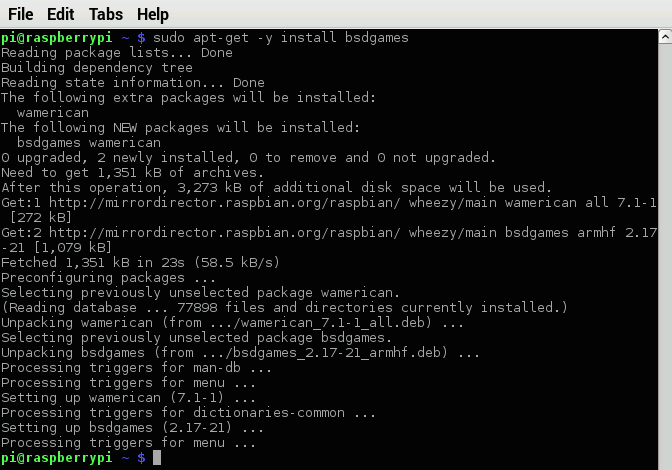
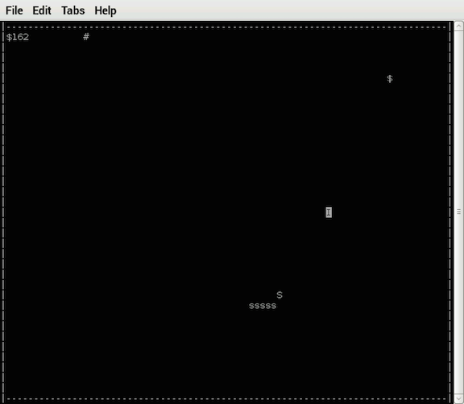

Getting Started with Raspberry Pi
=================================

#### Objectives
1. [Build a tiny computer](01-build.md)
2. [Set it up just so](02-configuring.md)
3. [Explore the Raspbian desktop](03-raspbian-desktop.md)
4. [Learn a little Linux](04-linux-101.md)
5. **[Update and install software](05-apt-get.md)**

# Updating and installing Raspberry Pi software

All computers (even the cute little Raspberry Pi) have an *operating system* which is composed of hundreds or thousands of separate pieces of computer code. Whenever you want to add new abilities to a computer, you have to install even more code. It's important to keep your software up-to-date in order to get access to the latest features :star:, avoid security problems :imp:, and fix bugs :ant: but how to keep it all straight?

:bowtie: The kind folks who make Linux available publish lists of the latest versions of software on special websites, along with special computer instructions to install and update them.

## Updating your software

Every so often (starting today) it's essential to refresh the list of available software, compare it to what's currently installed, and automatically update everything where possible. The command-line tool for interacting with installed software is **apt** (short for Advanced Packaging Manager).

* Start by entering this command in a Terminal: `sudo apt-get update`

**You will see some text scroll by as the system accesses the remote list and updates the Raspberry Pi's local copy of the list.**

* Now enter this command: `sudo apt-get -y upgrade`

#### Challenges

1. Read the upgrade log and determine the name of one program that was updated

## Finding and installing software

What if you want to install new software on the Raspberry Pi. Much of the time (but not always) such software is available in the public Linux catalog, which means you can find and install it using **apt**

Let's find a challenging game of **Snake** to install.
* If you haven't updated in a while remember to start by entering `sudo apt-get update`
* Type in `apt-cache search snake` and look at the response

**It looks like several packages might fit the bill.**

How can we learn more about any specific program?

* Enter this command: `apt-cache show bsdgames`

**Based on the description, it looks like you get a lot of games!**

Let's install **bsdgames**!

* Enter this command in a Terminal: `sudo apt-get -y install bsdgames`

**You will see a listing go by of everything installed to make bsdgames work**

* Now, let's type `snake` and see this thing in its full glory!

**Hooray! You installed and launched snake. Type X to quit**

#### Challenges

1. Find out if there are any good Nintendo games available

#### What you learned

1. The Raspberry Pi keeps a list of software for Linux but this list needs to be updated on occasion
2. You can upgrade all your installed software at once
3. You can search for and install specific kinds of software

## Additional Resources

* [Raspberry Pi Official APT page](https://www.raspberrypi.org/documentation/linux/software/apt.md)
* [Materials List for "Getting Started with Raspberry Pi"](10-materials.md)

