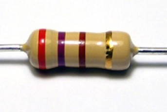
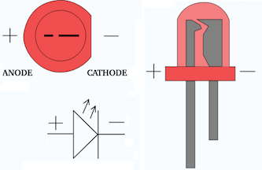

Physical Computing with Raspberry Pi
====================================

#### Objectives
1. **[Build a programmable LED light](01-led.md)**
2. [Make your light blink using Python](02-programming.md)
3. [Add a pushbutton switch to your circuit](03-switch.md)

# Building a programmable light

Computers can interface with not just with other computers but with nearly anything in the real world, including motors, servos, lights, and sensors. Because a computer program can encode extremely complex behavior, this is how most interactive, automated objects in our world work. We're going to take the first simple steps to creating a programmable thing by connecting your Raspberry Pi to a light emitting diode.

## Raspberry Pi output pins

Along the top right of the Raspberry Pi circuit board is a 2 row, 20 column matrix of "pins". These are intended for **project makers like you** to hook it up to the real world. Let's take a quick tour through the various pins as they all have specific functions that you can tap into. 

* 3.3v and 5v DC Power - These provide low current power that can be used to drive small circuits
* Ground - These pins are the _ground_ in an electrical circuit
* GPIO - This acronym stands for _general purpose input/output_. You reconfigure GPIO pins using software code to tell them how to behave (we'll dig more into this later)

## Prototype your first circuit

Anyone can build a simple circuit, but not everyone can make it work using a Raspberry Pi!

### Introducing your prototyping kit

Each student has been issued with a ziploc bag containing various components needed to complete this project. 

| Part | Notes |
|------|-------|
| Solderless Breadboard | Ultra-handy pluggable playground for trying out circuits |
| Jumper Wires | These are used to make connections between circuit components on the breadboard |
| Cobbler | A special adapter that allows a Pi to be connected to a breadboard |
| LEDs | Light emitting diodes emit single-wavelength light and are available in many colors and form factors |
| Resistors | Components that reduce voltage and current flow through a circuit |
| Momentary switch | Basically, a push button |
| Pulsox bits | We may want to include all the pulsox bits here as well |

#### Breadboard

Solderless breadboards are a cheap, reusable way to make quick circuits and test out ideas before making a permanent Printed Circuit Board. They often look like this:

You can see there are holes where things might get plugged in, but these have a special feature. Although you can't see it, inside the breadboard are many strips of metal that connect the rows and columns together. The metal strips are springy so that when you poke a wire into the hole, the clips grab onto it. In the image above you can see how there are two kinds of metal strips: short ones that connect 5 row holes at a time, and very long ones that connect 25 (or more!) column holes at a time. The long columns are called **rails** and the short strips are called **rows**.

#### Wires

To use a breadboard, you need 22 gauge solid-core (not stranded) wires that have been cut to size and had the insulation pulled off at their ends. You can also buy jumper wires wiht fancy plastic tips from any electronics supply store.

**Cut the wire first**

**Pull off insulation at the tips**

**Voila, your completed jumper wire**

:star: **A note on wire colors:** Wires connected to **ground* are usually black, while wires connected directly to a source of current are usually **red**. Beyond that you are free to use whatever colors you wish!

#### Resistors

Resistors are good at one thing: *resisting* the flow of electricity (otherwise known as current). This allows you, as a circuit designer, control where and how fast current flows.

:star: A helpful way of thinking about electrical current and resistance is to think of it in terms of water pressure in a tube. If you have water flowing in a tube and you put a smaller pipe in line, there will be more resistance to water flow. On the other hand, attaching a larger pipe will lead to less resistance to water flow.

**Reading Resistor Codes**

Resistance is measured in **ohms**, often written as the symbol Ω. The bigger the resistance value (in ohms) the more it prevents current flow. Every resistor has printed on it a special code that lets you know what its resistance is. It's a challenge when you are starting out to remember which values are which, but you'll get the hang of it soon enough with some practice!

**:question: What is the value of this resistor?**

#### LEDs

LED stands for **Light Emitting Diode**, and they (usually) have long lifespans and require little power. Because of these characteristics, you've probably got 100 of these in your house on various electrical devices! The light-emitting part of the name makes sense, but what does diode mean?

A diode is basically a one-way street for current. Imagine such a one-way street with a traffic enforcement officer in front. If you want to turn onto the street the wrong way, she will not let you. Likewise a diode simply does not let current go through it the wrong way. Current in a diode can only flow from the positive side to the negative side.

Most LEDs only require a small amount of current. Never connect an LED directly inline in a circuit unless you know for a fact that the current will never exceed that maximum rating for the LED. Otherwise, you will need to buy a new LED :pensive:

**The longer lead on an LED is the positive side (anode), while the shorter lead is the negative (cathode) side.**

### Attach the Cobbler to the prototyping board

*Photos demonstrating orientation*

### Create your simple circuit

Explanation of the circuit, including why we need a resistor

[Fritzing diagram of the circuit](images/led-101_bb.png)

**Wire up the circuit exactly as shown. :boom: Make sure  the LED is in the correct orientation or it will not light when we power it up.**

:question: What is the value in Ohms of the resistor we are using in this circuit?

# Challenges
* None

# Resources
* [Graphical Resistor Chart](http://resistor.cherryjourney.pt)
* [Sparkfun](http://www.sparkfun.com/)
* [Adafruit Industries](http://www.adafruit.com/)

# Acknowledgements
1. Lady Ada for images and inspiration pertaining to the breadboarding tutorial

