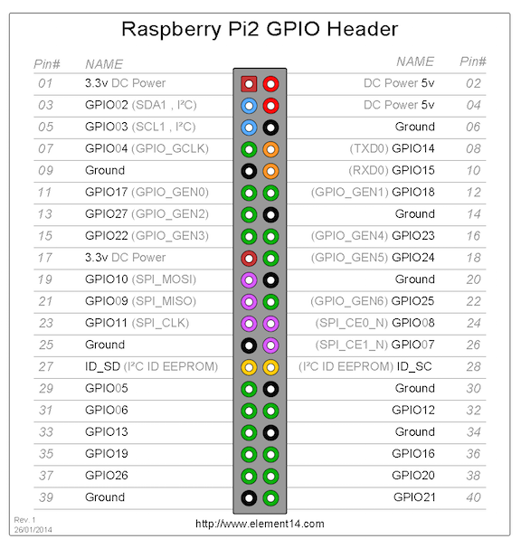
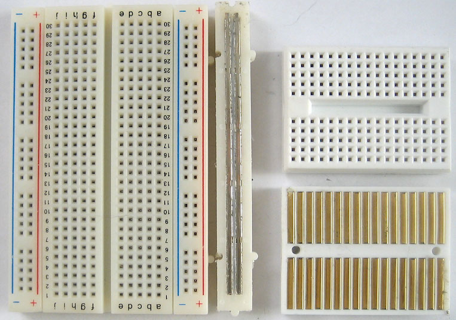
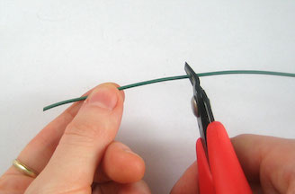
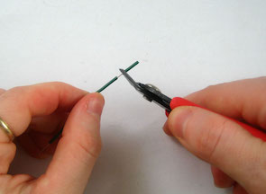
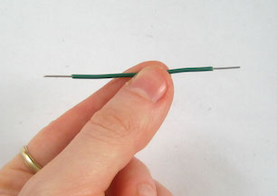
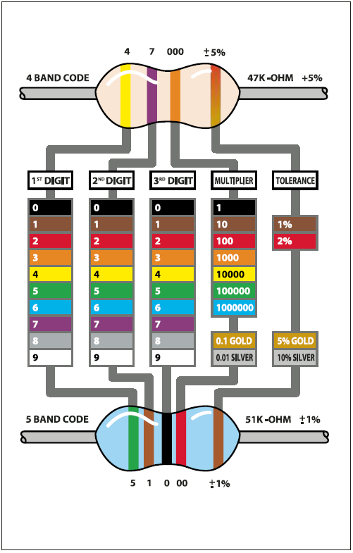

Physical Computing with Raspberry Pi
====================================

#### Objectives
1. **[Build a programmable LED light](01-led.md)**
2. [Make your light blink using Python](02-programming.md)
3. [Add a pushbutton switch to your circuit](03-switch.md)

# Building a programmable light

Overview

## Raspberry Pi output pins

## Prototype your first circuit

### Introducing your prototyping kit

| Part | Notes |
|------|-------|
| Solderless Breadboard | Ultra-handy pluggable playground for trying out circuits |
| Jumper Wires | These are used to make connections between circuit components on the breadboard |
| Cobbler | A special adapter that allows a Pi to be connected to a breadboard |
| LEDs | Light emitting diodes emit single-wavelength light and are available in many colors and form factors |
| Resistors | Components that reduce voltage and current flow through a circuit |
| Momentary switch | Basically, a push button |
| Pulsox bits | We may want to include all the pulsox bits here as well |

#### Breadboard

Solderless breadboards are a cheap, reusable way to make quick circuits and test out ideas before making a permanent Printed Circuit Board. They often look like this:

You can see there are holes where things might get plugged in, but these have a special feature. Although you can't see it, inside the breadboard are many strips of metal that connect the rows and columns together. The metal strips are springy so that when you poke a wire into the hole, the clips grab onto it. In the image above you can see how there are two kinds of metal strips: short ones that connect 5 row holes at a time, and very long ones that connect 25 (or more!) column holes at a time. The long columns are called **rails** and the short strips are called **rows**.

#### Wires

To use a breadboard, you need 22 gauge solid-core (not stranded) wires that have been cut to size and had the insulation pulled off at their ends. You can also buy jumper wires wiht fancy plastic tips from any electronics supply store.

**Cut the wire first**

**Pull off insulation at the tips**

**Voila, your completed jumper wire**

#### Resistors

Resistors are good at one thing: *resisting* the flow of electricity (otherwise known as current). This allows you, as a circuit designer, control where and how fast current flows.

:star: If we were talking about water current, then pipes are like resistors. Thin pipes let less water through (high resistance), thick pipes let a lot of water through (low resistance). Wth a fire hydrant, you want low resistance. With a water fountain, you'd want high resistance.

Resistance is measured in **ohms**, often written as the symbol Ω. The bigger the resistance value (in ohms) the more it prevents current flow. Every resistor has printed on it a special code that lets you know what its resistance is. It's a challenge when you are starting out to remember which values are which, but you'll get the hang of it soon enough with some practice!

**:question: What is the value of this resistor?**

### Attach the Cobbler to the prototyping board

*Photos demonstrating orientation*

### Create your simple circuit

Explanation of the circuit, including why we need a resistor

[Fritzing diagram of the circuit](images/led-fritz.png)

**Wire up the circuit exactly as shown.  Make sure  the LED is in the correct orientation or it will not light when we power it up.**

Aside: Resistor values. Find the 220 Ohm resistor in your kit (red/red/brown/gold)

# Challenges
* None

# Resources
* [Graphical Resistor Chart](http://resistor.cherryjourney.pt)
* [Sparkfun](http://www.sparkfun.com/)
* [Adafruit Industries](http://www.adafruit.com/)

# Acknowledgements
1. Lady Ada for images and inspiration pertaining to the breadboarding tutorial

