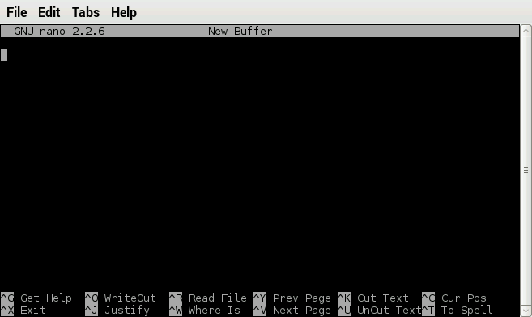
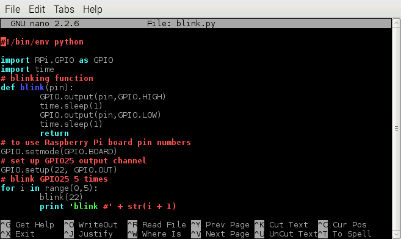

Physical Computing with Raspberry Pi
====================================

#### Objectives
1. [Build a programmable LED light](01-led.md)
2. **[Make your light blink using Python](02-programming.md)**
3. [Add a pushbutton switch to your circuit](03-switch.md)

# Make your light blink using Python

Overview

You have made a circuit for the Pi to control, but how do we tell the Pi what to do? :snake:Python to the rescue!

## Create a simple blink program in Python

To make sure this works for everyone, we're going to cut and paste a program instead of typing it all in. Feel free to start with this program in the future when you make your own projects!

* Open LXTerminal and start the **nano** text editor by typing `nano` followed by tapping the **Return** key.



Like **raspi-config**, the **nano** program is a text-based program. You can use code editor like IDLE or a text editor like Leafpad to write your code but we're doing it this way to get you more familiar with the text-based way of getting around. It might seem old-fashioned but the most powerful computers on the planet (like the one down the hall that you have toured) speak this language. 

```python
#!/bin/env python

# Bring in some functions from Python libraries
import RPi.GPIO as GPIO
import time

# Define a blink function
def blink(pin):
    # Send 3.3V out of the pin (turn it on)
    GPIO.output(pin,GPIO.HIGH)
    # Wait a second
    time.sleep(1)
    # Send 0V out of the pin (turn it off)
    GPIO.output(pin,GPIO.LOW)
    # Wait again
    time.sleep(1)
return

# Configure things to use Raspberry Pi board pin numbers
GPIO.setmode(GPIO.BOARD)
# Tell the Pi that GPIO25 should be an output channel
GPIO.setup(22, GPIO.OUT)

# Blink GPIO25 10 times using a loop
for i in range(0,10):
    blink(22)
    # Print to the screen so we can confirm things should be functioning
    print 'blink #' + str(i + 1)

# At the end, reset the GPIO system to how we found it    
GPIO.cleanup()
```

* Copy and paste in the following code from a web browser into **nano**. Your screen should look like this:



* Save this pasted text to a file named **blink.py** by entering **Control-O**, specifying the name of the file. Then, then quit **nano** by entering **Control-X**.
* List your local directory (by typing *ls* in LXterminal) to verify that blink.py was saved in it

## Running the blink.py program


Let's throw a class-wide disco party of blinking lights:

* Enter the following words into the Terminal and keep an eye on your prototyped circuit: `sudo python blink.py`

:star: The word `sudo` means run Python as a **super-user** instead of the regular "pi" user. The super-user is the boss of other users on a Linux system. We need to do this because not just any user is allowed to control the GPIO pins on a Raspberry pi. 

**Did your LED light blink?** If so, you've taken your first steps towards building this...


## Editing the blink.py program

Open the blink.py file in nano by entering the following command in a Terminal window `nano blink.py`. Move around within the file using the arrow keys. Delete characters with the **Delete** key and insert characters by putting the cursor at the location you want to modify. Save the file using **Control-O** and quit **nano** with **Control-X**. Feel free to explore other command in nano (there's a link to a quick tutorial in the Resources section)

# Challenges
* Change the number of times the LED flashes
* Increase the resistor value to 1000 Ohms - what happens?
* Make the LED flash faster or slower
* Update the circuit and code so the LED is controlled by another GPIO pin
* Update the circuit and code to add a second LED controlled by another GPIO pin

# Resources
* [Nano manual](http://mintaka.sdsu.edu/reu/nano.html)
* [GPIO Pin Diagram](images/GPIO_Pi2.png)
* [Adafruit Industries Wearables Central](http://www.adafruit.com/category/65)
