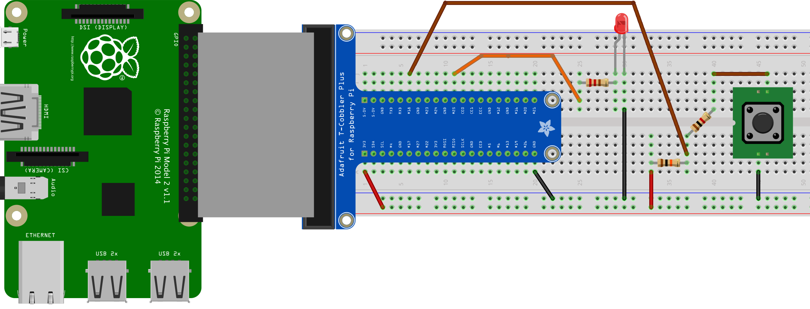
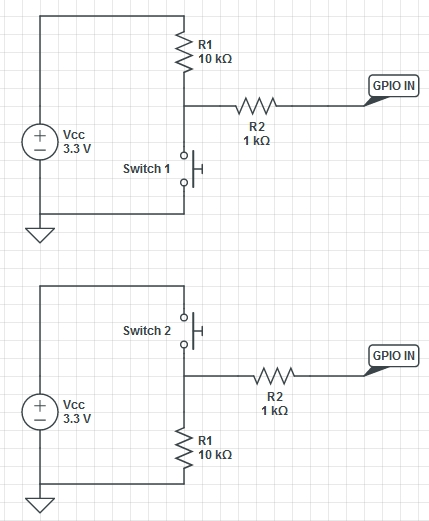

Physical Computing with Raspberry Pi
====================================

#### Objectives
1. [Build a programmable LED light](01-led.md)
2. [Make your light blink using Python](02-programming.md)
3. **[Add a pushbutton switch to your circuit](03-switch.md)**

# Add a pushbutton switch to your circuit

Connecting a Raspberry Pi to an LED lets you control a small part of the world from within your own computer program. The other half of the equation is learning what the world has to say to your Raspberry Pi and reacting inside a program. In this exercise, we will connect the simplest of sensors, a pushbutton switch, to our Pi and learn to detect when someone pushes it. 

## Wire up our switch circuit

If you have come here from the [LED tutorial](01-led.md), you will be adding to an existing circuit so that it resembles this diagram. If you are coming straight to this sensor tutorial, your circuit will look like [this](images/just-switch_bb.png) when complete.

### Mount the pushbutton switch

* Insert the switch into the breadboard as show in the photograph. Please note that the sets of wires shown as being "connected" should each connect to a different row on the breadboard. If you are not sure you have this set up right, please ask an instructor.

:star: Make sure to insert the switch fully into the breadboard, but also very gently so as not to bend the legs.

### Digital pins, pull-up, and pull-down resistors

This next bit will start off seeming complicated, but it's important to learn to avoid getting wierd results or burning out pins on the Raspberry Pi :grimacing:

* The GPIO pins on a Raspberry Pi can be configured as either **inputs or outputs**
* When a pin is configured for INPUT, it is very sensitive to small amounts of current
* If there is no input, the pin will report random changes to the value :confounded: making them sort of useless
* The solution is to steer the pin to enter either high or low state when there's no input
* While we're at it, we want to protect the GPIO pins in case one accidentally configures a pin attached to an INPUT circuit as an OUTPUT pin

Top: **Pull-up resistor** - connect the pin via a 10kΩ resistor to **3V3**
Bottom: **Pull-down resistor** - connect the pin via a a 10kΩ resistor to **GND**
Both: **Current limit resistor** - protect the GPIO pin from accidential short circuits

* Our circuit features a 10kΩ pullup resistor that pulls pin **#18** up to **3V3** connected to a switch with a 1kΩ protector resistor connected to **GND**. Go ahead and wire it up as in the circuit diagram.

# Challenges
* Identify 3-4 other types of switches and what uses they might have
* Describe how you might reconfigure our circuit to use a pulldown resistor (don't worry about code changes we might have to make, just focus on the circuit) with pin **#18**

# Resources
* [Physical computing with Raspberry Pi](https://www.cl.cam.ac.uk/projects/raspberrypi/tutorials/robot/buttons_and_switches/) courtesy of the [University of Cambridge Computer Laboratory](https://www.cl.cam.ac.uk/)
* [Arduino Buttons and Switches Tutorial](http://www.ladyada.net/learn/arduino/lesson5.html)