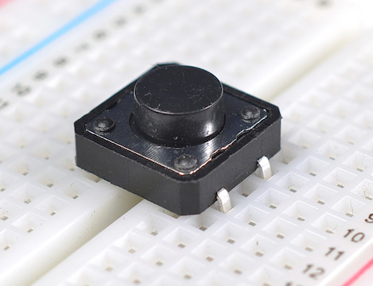

Physical Computing with Raspberry Pi
====================================

#### Objectives
1. [Build a programmable LED light](01-led.md)
2. [Make your light blink using Python](02-programming.md)
3. **[Add a pushbutton switch to your circuit](03-switch.md)**

# Add a pushbutton switch to your circuit

Connecting a Raspberry Pi to an LED lets you control a small part of the world from within your own computer program. The other half of the equation is learning what the world has to say to your Raspberry Pi and reacting inside a program. In this exercise, we will connect the simplest of sensors, a pushbutton switch, to our Pi and learn to detect when someone pushes it. 

## Wire up a switch circuit

If you have come here from the LED tutorial, you will be adding to the existing circuit so that it resembles this diagram. If you are coming straight to this sensor tutorial, your circuit will look like [this](images/just-switch_bb.png)

### Mount the pushbutton switch

Cautionary information about not bending the legs and making sure the thing is embedded in the breadboard

### Connect it up to the Raspberry Pi

* Make a connection to the shared **GND** rail
* Connect **18** to the other pole of the switch

### Digital pins, pull-up, and pull-down resistors

* The GPIO pins on a Raspberry Pi can be configured as either inputs or outputs
* When a pin is configured for INPUT, it is very sensitive to small amounts of current
* If there is no input, the pin will report random changes to the value :confounded: making them sort of useless
* The solution is to steer the pin to enter either high or low state when there's no input

* **Pull-up resistor** - connect the pin plus a resistor to **3V3**
* **Pull-down resistor** - connect the pin via a resistor to **GND**

We won't have to worry about doing this for today's circuit because the Raspberry Pi has 

Resources
* [Physical computing with Raspberry Pi](https://www.cl.cam.ac.uk/projects/raspberrypi/tutorials/robot/buttons_and_switches/) courtesy of the [University of Cambridge Computer Laboratory](https://www.cl.cam.ac.uk/)
