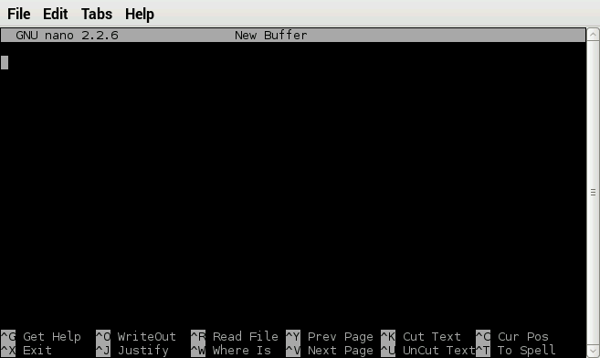

Physical Computing with Raspberry Pi
====================================

#### Objectives
1. [Build a programmable LED light](01-led.md)
2. [Make your light blink using Python](02-programming.md)
3. **[Add a pushbutton switch to your circuit](03-switch.md)**

# Add a pushbutton switch to your circuit

Connecting a Raspberry Pi to an LED lets you control a small part of the world from within your own computer program. The other half of the equation is learning what the world has to say to your Raspberry Pi and reacting inside a program. In this exercise, we will connect the simplest of sensors, a pushbutton switch, to our Pi and learn to detect when someone pushes it. 

## Wire up our switch circuit


If you have come here from the [LED tutorial](01-led.md), you will be adding to an existing circuit so that it resembles this diagram. If you are coming straight to this sensor tutorial, your circuit will look like [this](images/just-switch_bb.png) when complete.

### Mount the pushbutton switch


* Insert the switch into the breadboard as show in the photograph. Please note that the sets of wires shown as being "connected" should each connect to a different row on the breadboard. If you are not sure you have this set up right, please ask an instructor.

:star: Make sure to insert the switch fully into the breadboard, but also very gently so as not to bend the legs.

### Digital pins, pull-up, and pull-down resistors

This next bit will start off seeming complicated, but it's important to learn to avoid getting wierd results or burning out pins on the Raspberry Pi :grimacing:

* The GPIO pins on a Raspberry Pi can be configured as either **inputs or outputs**
* When a pin is configured for INPUT, it is very sensitive to small amounts of current
* If there is no input, the pin will report random changes to the value :confounded: making them sort of useless
* The solution is to steer the pin to enter either high or low state when there's no input
* While we're at it, we want to protect the GPIO pins in case one accidentally configures a pin attached to an INPUT circuit as an OUTPUT pin


Top: **Pull-up resistor** - connect the pin via a 10kΩ resistor to **3V3**
Bottom: **Pull-down resistor** - connect the pin via a a 10kΩ resistor to **GND**
Both: **Current limit resistor** - protect the GPIO pin from accidential short circuits

* Our circuit features a 10kΩ pullup resistor that pulls pin **#18** up to **3V3** connected to a switch with a 1kΩ protector resistor connected to **GND**. Go ahead and wire it up as in the circuit diagram.

## Programming the Raspberry Pi to respond to the switch

To make sure this works for everyone, we're going to cut and paste in the program instead of typing it all in. Feel free to start with this code in the future when you make your own projects!

* Open LXTerminal and start the **nano** text editor by typing `nano` followed by tapping the **Return** key.



Now copy and paste this code from your browser into the **nano** window

```python
#!/bin/env python

# Bring in some functions from Python libraries
import RPi.GPIO as GPIO
import time

# Set up GPIO to use BCM pin numbers
GPIO.setmode(GPIO.BCM)
# Set up GPIO pin 18 as an INPUT pin
GPIO.setup(18, GPIO.IN)

# Loop over and over
while True:
    # Check the state of pin 18
    input_state = GPIO.input(18)
    # In our circuit, pushing the button
    # makes the pin go to LOW and in Python
    # this means GPIO.input will return False
    # rather than True
    if input_state == False:
        # Print a little message to screen
        # then wait a tiny bit to let the
        # switch re-open after being pushed
        print('Button Pressed')
        time.sleep(0.2)
```

* Save this pasted text to a file named **switch.py** by entering **Control-O**, specifying the name of the file. Then, then quit **nano** by entering **Control-X**.
* List your local directory (by typing *ls* in LXterminal) to verify that switch.py was saved in it

## Run the switch.py program

* Enter the following words into the Terminal: `sudo python switch.py`

:question: Why do we need to put **sudo** in front of the **python** command?

* Now, press the button on your breadboard and watch the Terminal window where switch.py is running. The program should print _Button Pressed_ to the screen every time you or your partner pushes the button. 


# Challenges
* Debug the following python program so that it will flash the LED every time you push the button. Show off to the class when you get it working!
```python
#!/bin/env python

import RPi.GPIO as GPIO
import time

# Define the blinking function
def blink(pin):
    GPIO.output(pin,GPIO.LOW)
    time.sleep(0.10)
    GPIO.output(pin,GPIO.LOW)
    return

# Use BCM pin numbers
GPIO.setmode(GPIO.BCM)

# Set up a pin for input
GPIO.setup(24, GPIO.IN)
# Set up an output channel to control the LED
GPIO.setup(21, GPIO.OUT)

while True:
    input_state = GPIO.input(18)
    if input_state == True:
        print('Button Pressed')
        blink(25)
```
* Describe how you might reconfigure our circuit to use a pulldown resistor (don't worry about code changes we might have to make, just focus on the circuit) with pin **#18**
* List 3-4 other things you could do in response to a button press. What if you had multiple buttons - what could you do then?

# Resources
* [O'Reilly Raspberry Pi Cookbook](http://razzpisampler.oreilly.com/ch07.html)
* [Physical computing with Raspberry Pi](https://www.cl.cam.ac.uk/projects/raspberrypi/tutorials/robot/buttons_and_switches/) courtesy of the [University of Cambridge Computer Laboratory](https://www.cl.cam.ac.uk/)
* [Make: Tutorial: Raspberry Pi GPIO Pins and Python](http://makezine.com/projects/tutorial-raspberry-pi-gpio-pins-and-python/)
