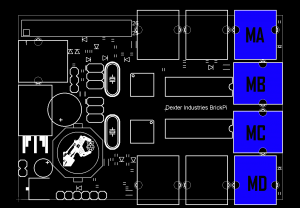

Pi, Robot
=========

#### Objectives
1. Assemble the BrickPi unit
2. Configure the Raspberry Pi
3. Test the BrickPi system
4. Build your first robot

You will work in teams of at least two (though you can add friends if you like). One team member's Raspberry Pi will act as the embedded brain for various robot inventions. The other Raspberry Pi will act as a control center for programming the one controlling the robots.

## Assemble the BrickPi unit

* Follow along with the instructors to learn how to assemble your group's BrickPi

## Configure the Raspberry Pi

:star: Follow these steps on the both the Pi unit destined for use in the BrickPi as well as the system used to control it.

### Basic settings

We have already configured the Raspberry Pis with these settings. If you are setting up a new system, these are the **raspi-config** settings for connecting to a BrickPi.

* Access **raspi-config** configuration GUI by running the command `sudo raspi-config`
* Under the **8 Advanced Options** set the following
  * SPI **Enable**
  * I2C **Enable**
  * Shell messages on a serial connection **Disable**

### Install the BrickPi software

The instructors have already done this for you on each Raspberry Pi. If we encounter problems, one possible route for troubleshooting them is to run these installer scripts again.

```shell
cd /home/pi/summer-2015/robotics
sudo bash setup1.sh
```

* After this set of commands finishes running, the Pi will restart. When that finishes, open a new Terminal and enter the following commands:

```shell
cd /home/pi/summer-2015/robotics
sudo bash setup2.sh
```

## Test the BrickPi system



1. Connect a LEGO Mindstorms motor to BrickPi Motor Port B
2. Open a Terminal window and run the following commands

```shell
cd /home/pi/summer-2015/robotics/python
python test1.py
```

The LEGO motor should begin spinning and run for 10 seconds, reverse for another 10 seconds, then stop.

## Build your first robot

You will now spend some time with your partner building a robot with two powered wheels. You may implement your own design or take as much inspiration as you wish from these examples:

* [BrickPi SimpleBot #1](https://youtu.be/cWeCJrZRjJ0)
* [BrickPi SimpleBot #2](https://youtu.be/fT6j4trNEJ0)

:star: Both of these examples include an Ultrasonic sensor. There are many other types of LEGO sensors.

## On to the fun stuff...

* After assembling a simple robot, head over to the [Lessons page](python/LESSONS.md)

## Additional Resources
* [Dexter Industries: Getting Started with BrickPi](http://www.dexterindustries.com/BrickPi/getting-started/)
* [Dexter Industries BrickPi Forums](http://www.dexterindustries.com/forum/?forum=brickpi)
