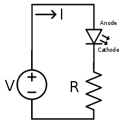
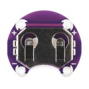
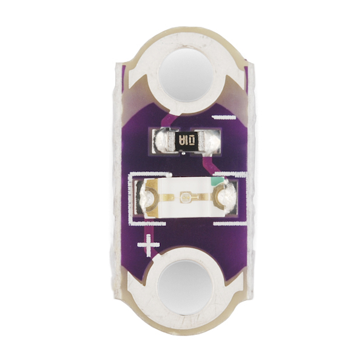
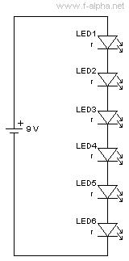
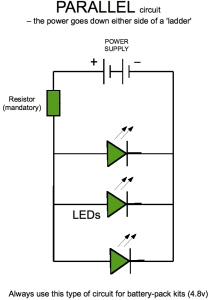
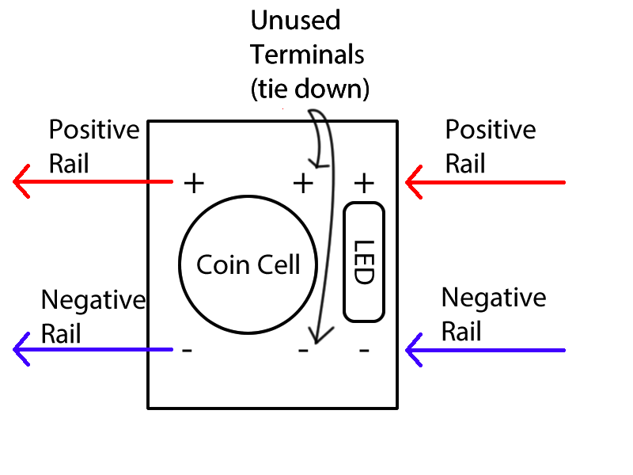

Sewable Electronics
===================
Sewable electronics are transitioning from a novelty hobby to something that will become useful in daily life. You can check out Google's Project Jacquard - an effort to create touch capacitive fabrics.

[Project Jacquard, on YouTube](https://youtu.be/qObSFfdfe7I)

In this project, we're going to play around with conductive thread and some sewable electronic components to create clothing that lights up. Later on, we can plug it into a microcontroller like the Raspberry Pi to make the lights flash and pulse.

Components:
-----------
* Conductive thread 
* Sewing needle
* Something to sew to (elastic band)
* Lilypad LEDs
* Lilypad Coin Cell Battery Holder
* Jumper wires for testing

Circuit Basics
--------------

This is a logical diagram of a simple circuit with an LED. It represents the flow of electricity in the circuit and the connections made between components, but not necessarily how the circuit will physically appear. Let's read the circuit together starting at the V, going clockwise

* V typically means "Voltage." This component with a positive and negative end is a battery.
* The arrow isn't a component. It's just marking the flow of the DC electricity
* The triangle is a diode, just like in the Raspberry Pi circuit. This diode, with the arrows, shows that it is a Light Emitting Diode, or LED. Electricity can only flow from anode to cathode, never backwards.
* The component with an R is a resistor

Lilypad Components
------------------
Lilypad is a sewable electronics system. The parts are designed to be easily embroidered into cloth. The terminals for each component are holes that you can loop and tie thread through.

### Coin Cell Battery Holder

This provides power using a CR2032 battery. It will provide 3.7 volts of electricity. Notice that it has two positive and negative terminal paris. That means it could, in theory, power two separate circuits. We're only going to use one side.

### Lilypad LED

This component is a combination of an LED and a resistor, since you would never use an LED without a resistor. Notice that it has a positive anode side and a negative cathode side.

Building a Test Circuit
-----------------------
Try building a test circuit with the breadboard and your jumper wires. You always want to test your circuit design before you begin sewing! You can use the jumper wires to pin the components to the breadboard. Remember - each row of the breadboard makes a logical connection to every hole on that row. So if you were to pin mount a Lilypad LED to the bread board, put each hole on a different set of rows!

Series Circuit
--------------

Try making a test circuit that looks like this. These are LED in series. Series circuits have the following properties:

* If any single LED goes out, the entire circuit will be broken.
* LEDs consume a little bit of voltage. After a while, the amount of voltage received by the last component may be less than the first one.
* When sewing with conductive thread, series circuits can be difficult to troubleshoot without a multimeter.

Parallel Circuit
----------------

This is a parallel circuit. Try making it on your breadboard. It might be a little more complex to get working. As a hint, try using the rails on the bread board to represent the long sides of the "ladder." Parallel circuits have the following properties:

* If any single LED goes out, the rest remain active.
* Every LED will get the same voltage, in theory.
* In sewable electronics, you may still get some "fade" at the end of the ladder for a very long run of thread. That's simply because conductive thread actually has a fair amount of resistance in it, creating a voltage drop for long runs of thread.

Sewing Basics
-------------
This is the tricky part. Before you start sewing with conductive thread, let's go over some embroidery basics.

[Sewing Basics](https://youtu.be/bAmC5JNgK-s)

Some basic tips:

* Never cut a length of thread that is longer than your forearm. You will get knots, or you might end up accidentally poking your neighbor in the eye!
* Go slow until you get comfortable with it!
* Conductive thread is trickier than normal thread. It is a little stiff.
* Cut off stray thread tails. Conductive thread, if it touches itself, will short out. 
* Then it will heat up. 
* Then it will start glowing.
* Then it will catch on fire.
* Then it will burn you.
* But other than that it's perfectly safe.

Making Your Bracelet
--------------------
Cut a piece of elastic band to fit around your wrist, with a one inch overlap. You can sew a parallel circuit that actually looks a lot more similar to the logical circuit diagram than it does to your breadboard design. Here is a schematic of how to sew components to the bracelet. Start with the coin cell, one set of rails and one LED.

Important notes:

* The positive rail will be a strand of conductive thread that you stitch all the way around the bracelet from the left positive terminal of the battery holder to the positive terminal of the LED. Same with the negative rail.
* DO NOT connect the right positive and negative terminals to anything. You can use those terminals to sew the battery holder down with standard thread. If you use conductive thread, make sure the knots are trimmed!
* Once you verify that one LED is working, try placing LEDs around the bracelet between the rails with stitching to connect the terminal to the appropriate rail.

Making Your Bracelet Do Cool Stuff
----------------------------------

Remember our Raspberry Pi program that made an LED blink? Try the following:

* Remove the battery from the coin cell
* Use a jumper wire to connect the Raspberry Pi's GPIO output pin to the positive rail
* Use a jumper wire to connect the Raspberry Pi's GPIO ground pin to the negative rail
* Run the LED blink Python script!
